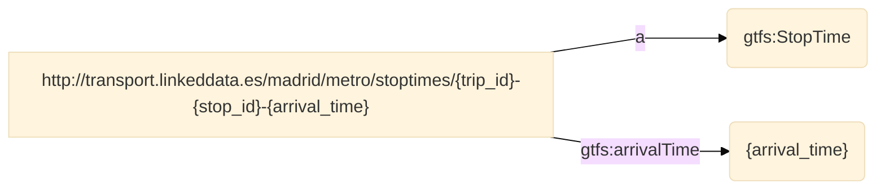

   
# GTFS-Madrid-Bench CSV mapping
   
   
**Version:**

* 0.1.0
   
**Authors**:

    
* Jhon Toledo
   
    
* Ana Iglesias-Molina
   

**Mapping file:**
mapping_title.ttl


**License**:

[-blue.svg)](https://creativecommons.org/licenses/by/4.0/)


------


## **Namespaces used in the document**

| Prefix       |               IRI.                   |
| :----------- | :----------------------------------  |
| rr     | http://www.w3.org/ns/r2rml# |
| rml     | http://semweb.mmlab.be/ns/rml# |
| schema1     | http://schema.org/ |
| gtfs     | http://vocab.gtfs.org/terms# |
| v     | http://rdf.data-vocabulary.org/# |
| ma     | http://www.w3.org/ns/ma-ont# |
| map     | http://mapping.example.com/ |
| dct     | http://purl.org/dc/terms/ |
| ql     | http://semweb.mmlab.be/ns/ql# |
| geo1     | http://www.w3.org/2003/01/geo/wgs84_pos# |
| sd     | http://www.w3.org/ns/sparql-service-description# |
| rev     | http://purl.org/stuff/rev# |


## Mappings
>[!NOTE]
>1. **Source**: This is where you define the source of your data, which can be a relational database, a CSV file, or any other structured data source. The logical source specifies the location and format of your source data.
>2. **Subject**: This part of the mapping defines how the data from the logical source will be used to create RDF subjects, typically using templates and column mappings.
>3. **Predicate Object**: These describe how the data from the logical source will be used to generate RDF triples, indicating relationships between subjects and objects.
>4. **JoinCondition**: is used to specify the conditions under which two data sources or tables should be joined when creating RDF triples through mappings.


## map_stoptimes_000
- **Source**

```bash
/data/STOP_TIMES.csv
``` 
- **Subject**
```bash
http://transport.linkeddata.es/madrid/metro/stoptimes/{trip_id}-{stop_id}-{arrival_time}
``` 
- **Predicate Object**

| Predicate | Object |
|:----------|:-------|
| a | gtfs:StopTime |
| gtfs:arrivalTime | {arrival_time} |
- **RDF triples**



----

**This documentation was generated using**  *[RMLdoc](https://oeg-upm.github.io/rmldoc/)*.
