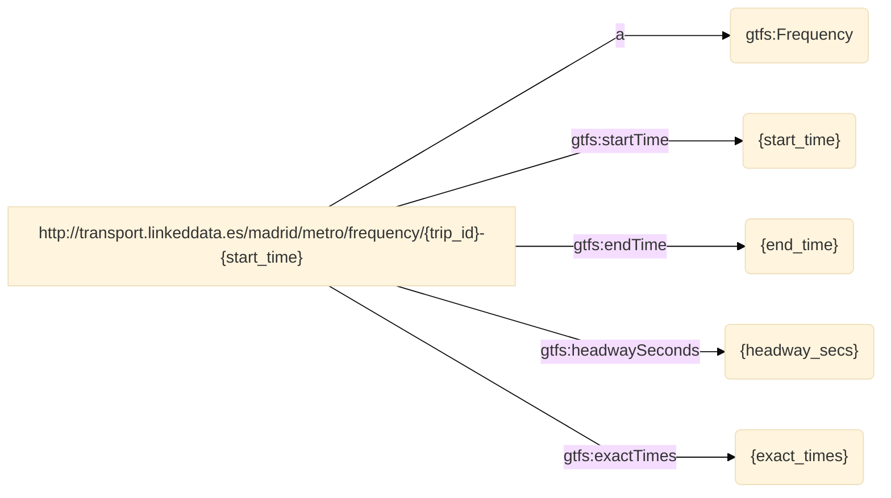
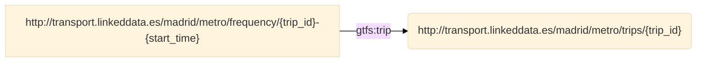
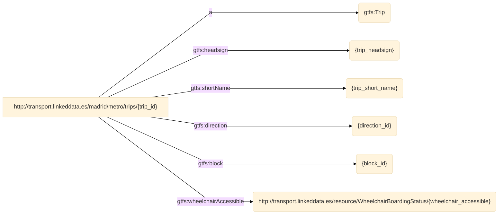

   
# GTFS-Madrid-Bench CSV mapping excerpt
   
   
**Version:**

* 0.1.0
   
**Authors**:

    
* Jhon Toledo
   
    
* Ana Iglesias-Molina
   

**Mapping file:**
example_input.ttl

**Description**: RML mapping with a subset of the GTFS-Madrid-Bench mapping for CSV files.


**Date created**: 03-05-2024

**License**:

[-blue.svg)](https://creativecommons.org/licenses/by/4.0/)


------


## **Namespaces used in the document**

| Prefix       |               IRI                   |
| :----------- | :----------------------------------  |
| gtfs     | http://vocab.gtfs.org/terms# |


## Mappings
>[!NOTE]
>1. **Source**: This is where you define the source of your data, which can be a relational database, a CSV file, or any other structured data source. The logical source specifies the location and format of your source data.
>2. **Subject**: This part of the mapping defines how the data from the logical source will be used to create RDF subjects, typically using templates and column mappings.
>3. **Predicate Object**: These describe how the data from the logical source will be used to generate RDF triples, indicating relationships between subjects and objects.
>4. **JoinCondition**: is used to specify the conditions under which two data sources or tables should be joined when creating RDF triples through mappings.


## frequencies
- **Source**

```bash
/data/FREQUENCIES.csv
``` 
- **Subject**
```bash
http://transport.linkeddata.es/madrid/metro/frequency/{trip_id}-{start_time}
``` 
- **Predicate Object**

| Predicate | Object |
|:----------|:-------|
| a | gtfs:Frequency |
| gtfs:startTime | {start_time} |
| gtfs:endTime | {end_time} |
| gtfs:headwaySeconds | {headway_secs} |
| gtfs:exactTimes | {exact_times} |
- **RDF triples**



- **Join Condition**:
    - Source triples map: **frequencies**
    - Target triples map: **trips**
    - Function: **equal(trip_id, trip_id)**



 ## trips
- **Source**

```bash
/data/TRIPS.csv
``` 
- **Subject**
```bash
http://transport.linkeddata.es/madrid/metro/trips/{trip_id}
``` 
- **Predicate Object**

| Predicate | Object |
|:----------|:-------|
| a | gtfs:Trip |
| gtfs:headsign | {trip_headsign} |
| gtfs:shortName | {trip_short_name} |
| gtfs:direction | {direction_id} |
| gtfs:block | {block_id} |
| gtfs:wheelchairAccessible | http://transport.linkeddata.es/resource/WheelchairBoardingStatus/{wheelchair_accessible} |
- **RDF triples**



----

**This documentation was generated using**  *[RMLdoc](https://oeg-upm.github.io/rmldoc/)*.
