# Mapping Documentation
   

**Version:**

* 0.1.0
   
**Authors**:

    
* Jhon Toledo Barreto
   
    
* Ana Iglesias-Molina
   

**Mapping file:**
example.ttl


**License**:

[-blue.svg)](https://creativecommons.org/licenses/by/4.0/)


------


## **Namespaces used in the document**

| Prefix       |               IRI.                   |
| :----------- | :----------------------------------  |
| rr     | http://www.w3.org/ns/r2rml# |
| comp     | http://semweb.mmlab.be/ns/rml-compression# |
| gtfs     | http://vocab.gtfs.org/terms# |
| rml     | http://semweb.mmlab.be/ns/rml# |
| formats     | http://www.w3.org/ns/formats/ |
| schema1     | http://schema.org/ |
| ql     | http://semweb.mmlab.be/ns/ql# |
| rev     | http://purl.org/stuff/rev# |
| grel     | http://users.ugent.be/~bjdmeest/function/grel.ttl# |
| fnml     | http://semweb.mmlab.be/ns/fnml# |
| geo1     | http://www.w3.org/2003/01/geo/wgs84_pos# |
| map     | http://mapping.example.com/ |
| d2rq     | http://www.wiwiss.fu-berlin.de/suhl/bizer/D2RQ/0.1# |
| dct     | http://purl.org/dc/terms/ |


## Mappings
>[!NOTE]
>1. **Source**: This is where you define the source of your data, which can be a relational database, a CSV file, or any other structured data source. The logical source specifies the location and format of your source data.
>2. **Subject**: This part of the mapping defines how the data from the logical source will be used to create RDF subjects, typically using templates and column mappings.
>3. **Predicate Object**: These describe how the data from the logical source will be used to generate RDF triples, indicating relationships between subjects and objects.
>4. **JoinCondition**: is used to specify the conditions under which two data sources or tables should be joined when creating RDF triples through mappings.


## services1
- **Source**

```bash
/data/CALENDAR.csv
``` 
- **Subject**
```bash
http://transport.linkeddata.es/madrid/metro/services/{service_id}
``` 
- **Predicate Object**

| Predicate | Object |
|:----------|:-------|
| a | gtfs:Service |
- **RDF triples**
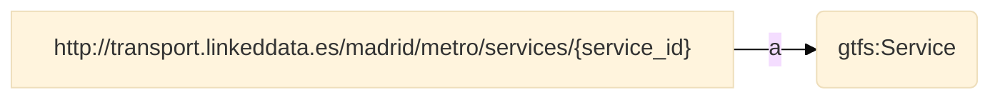


- **Join Condition**:
    - Source triples map: **services1**
    - Target triples map: **calendar_rules**
    - Function: **equal(service_id, service_id)**

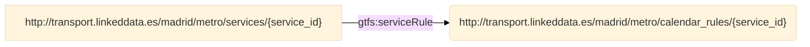

 ## shapePoints
- **Source**

```bash
/data/SHAPES.csv
``` 
- **Subject**
```bash
http://transport.linkeddata.es/madrid/metro/shape_point/{shape_id}-{shape_pt_sequence}
``` 
- **Predicate Object**

| Predicate | Object |
|:----------|:-------|
| a | gtfs:ShapePoint |
| geo1:lat | {shape_pt_lat} |
| geo1:long | {shape_pt_lon} |
| gtfs:pointSequence | {shape_pt_sequence} |
| gtfs:distanceTraveled | {shape_dist_traveled} |
- **RDF triples**
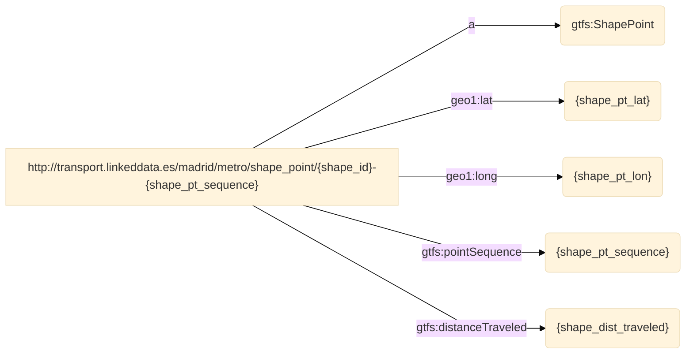
## routes
- **Source**

```bash
/data/ROUTES.csv
``` 
- **Subject**
```bash
http://transport.linkeddata.es/madrid/metro/routes/{route_id}
``` 
- **Predicate Object**

| Predicate | Object |
|:----------|:-------|
| a | gtfs:Route |
| gtfs:shortName | {route_short_name} |
| gtfs:longName | {route_long_name} |
| dct:description | {route_desc} |
| gtfs:routeType | http://transport.linkeddata.es/resource/RouteType/{route_type} |
| gtfs:routeUrl | {route_url} |
| gtfs:color | {route_color} |
| gtfs:textColor | {route_text_color} |
- **RDF triples**
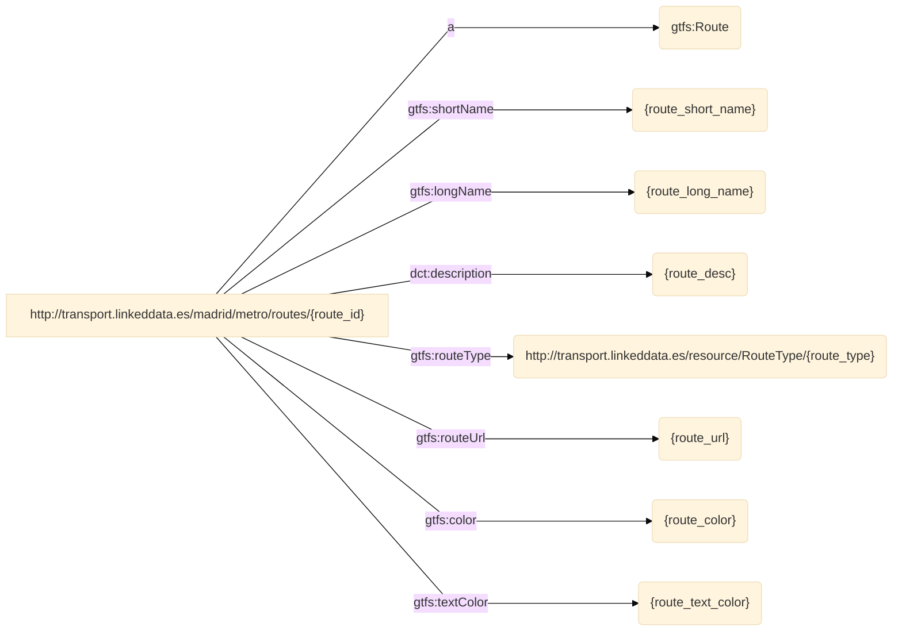


- **Join Condition**:
    - Source triples map: **routes**
    - Target triples map: **agency**
    - Function: **equal(agency_id, agency_id)**

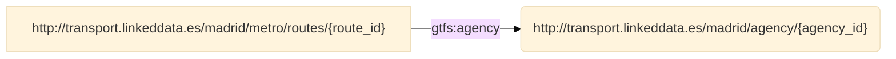

 ## frequencies
- **Source**

```bash
/data/FREQUENCIES.csv
``` 
- **Subject**
```bash
http://transport.linkeddata.es/madrid/metro/frequency/{trip_id}-{start_time}
``` 
- **Predicate Object**

| Predicate | Object |
|:----------|:-------|
| a | gtfs:Frequency |
| gtfs:startTime | {start_time} |
| gtfs:endTime | {end_time} |
| gtfs:headwaySeconds | {headway_secs} |
| gtfs:exactTimes | {exact_times} |
- **RDF triples**
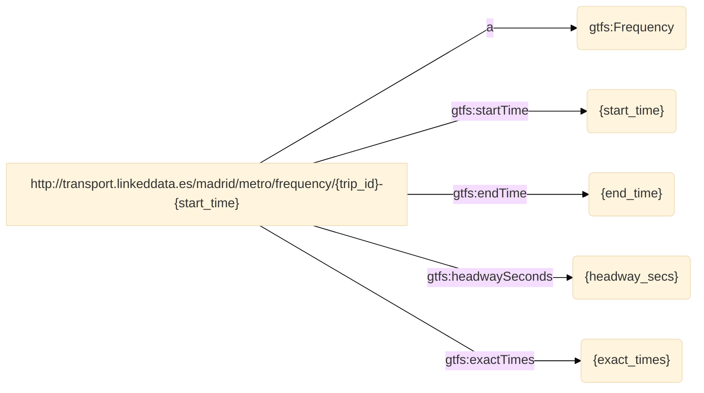


- **Join Condition**:
    - Source triples map: **frequencies**
    - Target triples map: **trips**
    - Function: **equal(trip_id, trip_id)**

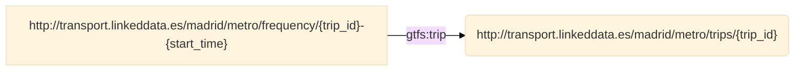

 ## services2
- **Source**

```bash
/data/CALENDAR_DATES.csv
``` 
- **Subject**
```bash
http://transport.linkeddata.es/madrid/metro/services/{service_id}
``` 
- **Predicate Object**

| Predicate | Object |
|:----------|:-------|
| a | gtfs:Service |
- **RDF triples**


- **Join Condition**:
    - Source triples map: **services2**
    - Target triples map: **calendar_date_rules**
    - Function: **equal(service_id, service_id)**

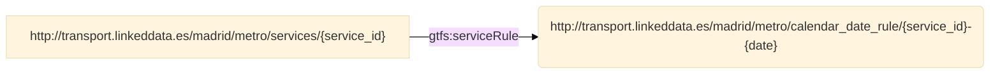

 ## calendar_date_rules
- **Source**

```bash
/data/CALENDAR_DATES.csv
``` 
- **Subject**
```bash
http://transport.linkeddata.es/madrid/metro/calendar_date_rule/{service_id}-{date}
``` 
- **Predicate Object**

| Predicate | Object |
|:----------|:-------|
| a | gtfs:CalendarDateRule |
| dct:date | {date} |
| gtfs:dateAddition | {exception_type} |
- **RDF triples**
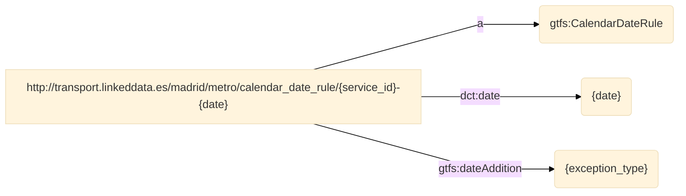
## trips
- **Source**

```bash
/data/TRIPS.csv
``` 
- **Subject**
```bash
http://transport.linkeddata.es/madrid/metro/trips/{trip_id}
``` 
- **Predicate Object**

| Predicate | Object |
|:----------|:-------|
| a | gtfs:Trip |
| gtfs:headsign | {trip_headsign} |
| gtfs:shortName | {trip_short_name} |
| gtfs:direction | {direction_id} |
| gtfs:block | {block_id} |
| gtfs:wheelchairAccessible | http://transport.linkeddata.es/resource/WheelchairBoardingStatus/{wheelchair_accessible} |
- **RDF triples**
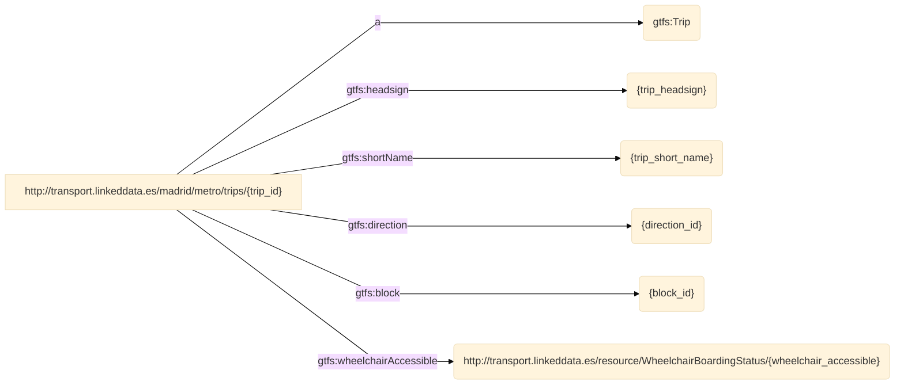


- **Join Condition**:
    - Source triples map: **trips**
    - Target triples map: **services1**
    - Function: **equal(service_id, service_id)**

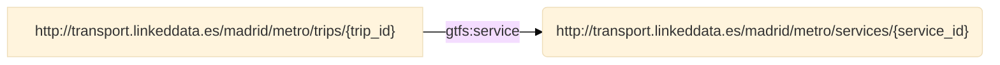


- **Join Condition**:
    - Source triples map: **trips**
    - Target triples map: **services2**
    - Function: **equal(service_id, service_id)**


- **Join Condition**:
    - Source triples map: **trips**
    - Target triples map: **routes**
    - Function: **equal(route_id, route_id)**

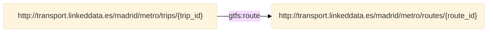


- **Join Condition**:
    - Source triples map: **trips**
    - Target triples map: **shapes**
    - Function: **equal(shape_id, shape_id)**

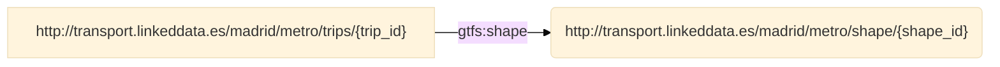

 ## stoptimes
- **Source**

```bash
/data/STOP_TIMES.csv
``` 
- **Subject**
```bash
http://transport.linkeddata.es/madrid/metro/stoptimes/{trip_id}-{stop_id}-{arrival_time}
``` 
- **Predicate Object**

| Predicate | Object |
|:----------|:-------|
| a | gtfs:StopTime |
| gtfs:arrivalTime | {arrival_time} |
| gtfs:departureTime | {departure_time} |
| gtfs:stopSequence | {stop_sequence} |
| gtfs:headsign | {stop_headsign} |
| gtfs:pickupType | http://transport.linkeddata.es/resource/PickupType/{pickup_type} |
| gtfs:dropOffType | http://transport.linkeddata.es/resource/DropOffType/{drop_off_type} |
| gtfs:distanceTraveled | {shape_dist_traveled} |
- **RDF triples**
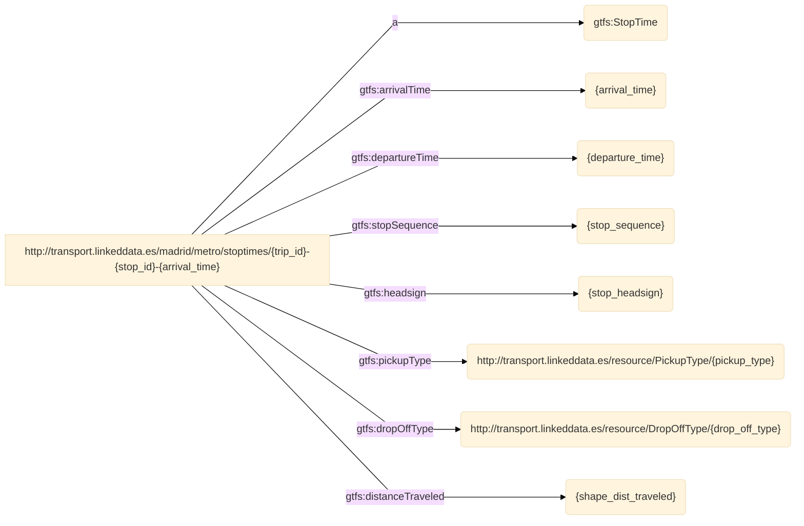


- **Join Condition**:
    - Source triples map: **stoptimes**
    - Target triples map: **trips**
    - Function: **equal(trip_id, trip_id)**

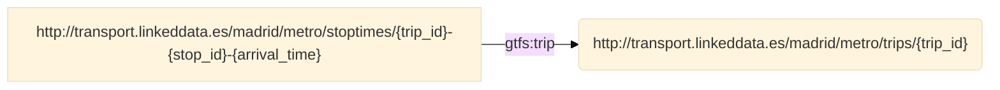


- **Join Condition**:
    - Source triples map: **stoptimes**
    - Target triples map: **stops**
    - Function: **equal(stop_id, stop_id)**

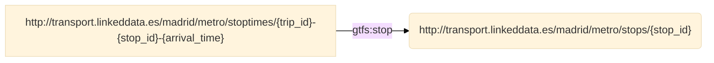

 ## stops
- **Source**

```bash
/data/STOPS.csv
``` 
- **Subject**
```bash
http://transport.linkeddata.es/madrid/metro/stops/{stop_id}
``` 
- **Predicate Object**

| Predicate | Object |
|:----------|:-------|
| a | gtfs:Stop |
| gtfs:code | {stop_code} |
| dct:identifier | {stop_id} |
| foaf:name | {stop_name} |
| dct:description | {stop_desc} |
| geo1:lat | {stop_lat} |
| geo1:long | {stop_lon} |
| gtfs:zone | {zone_id} |
| foaf:page | {stop_url} |
| gtfs:locationType | http://transport.linkeddata.es/resource/LocationType/{location_type} |
| gtfs:timeZone | {stop_timezone} |
| gtfs:wheelchairAccessible | http://transport.linkeddata.es/resource/WheelchairBoardingStatus/{wheelchair_boarding} |
- **RDF triples**
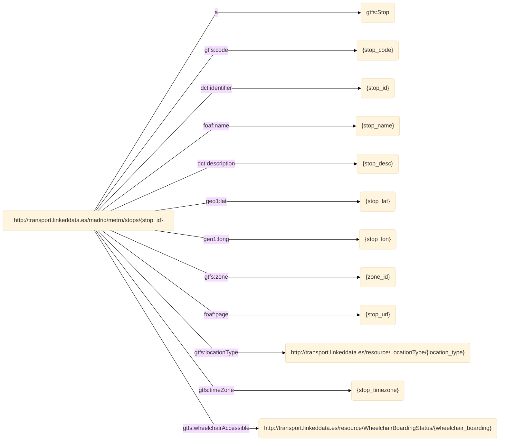


- **Join Condition**:
    - Source triples map: **stops**
    - Target triples map: **stops**
    - Function: **equal(parent_station, stop_id)**

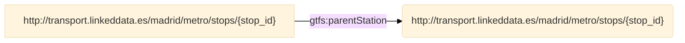

 ## agency
- **Source**

```bash
/data/AGENCY.csv
``` 
- **Subject**
```bash
http://transport.linkeddata.es/madrid/agency/{agency_id}
``` 
- **Predicate Object**

| Predicate | Object |
|:----------|:-------|
| a | gtfs:Agency |
| foaf:page | {agency_url} |
| foaf:name | {agency_name} |
| gtfs:timeZone | {agency_timezone} |
| dct:language | {agency_lang} |
| foaf:phone | {agency_phone} |
| gtfs:fareUrl | {agency_fare_url} |
- **RDF triples**
```mermaid
%%{ init : { "theme" : "base", "flowchart" : { "curve" : "linear" }}}%%
flowchart LR
S["http://transport.linkeddata.es/madrid/agency/{agency_id}"] -->|"a"| object1("gtfs:Agency")
S["http://transport.linkeddata.es/madrid/agency/{agency_id}"] -->|"foaf:page"| object2("{agency_url}")
S["http://transport.linkeddata.es/madrid/agency/{agency_id}"] -->|"foaf:name"| object3("{agency_name}")
S["http://transport.linkeddata.es/madrid/agency/{agency_id}"] -->|"gtfs:timeZone"| object4("{agency_timezone}")
S["http://transport.linkeddata.es/madrid/agency/{agency_id}"] -->|"dct:language"| object5("{agency_lang}")
S["http://transport.linkeddata.es/madrid/agency/{agency_id}"] -->|"foaf:phone"| object6("{agency_phone}")
S["http://transport.linkeddata.es/madrid/agency/{agency_id}"] -->|"gtfs:fareUrl"| object7("{agency_fare_url}")
    
``` 
## feed
- **Source**

```bash
/data/FEED_INFO.csv
``` 
- **Subject**
```bash
http://transport.linkeddata.es/madrid/metro/feed/{feed_publisher_name}
``` 
- **Predicate Object**

| Predicate | Object |
|:----------|:-------|
| a | gtfs:Feed |
| dct:publisher | {feed_publisher_name} |
| foaf:page | {feed_publisher_url} |
| dct:language | {feed_lang} |
| schema1:startDate | {feed_start_date} |
| schema1:endDate | {feed_end_date} |
| schema1:version | {feed_version} |
- **RDF triples**
```mermaid
%%{ init : { "theme" : "base", "flowchart" : { "curve" : "linear" }}}%%
flowchart LR
S["http://transport.linkeddata.es/madrid/metro/feed/{feed_publisher_name}"] -->|"a"| object1("gtfs:Feed")
S["http://transport.linkeddata.es/madrid/metro/feed/{feed_publisher_name}"] -->|"dct:publisher"| object2("{feed_publisher_name}")
S["http://transport.linkeddata.es/madrid/metro/feed/{feed_publisher_name}"] -->|"foaf:page"| object3("{feed_publisher_url}")
S["http://transport.linkeddata.es/madrid/metro/feed/{feed_publisher_name}"] -->|"dct:language"| object4("{feed_lang}")
S["http://transport.linkeddata.es/madrid/metro/feed/{feed_publisher_name}"] -->|"schema1:startDate"| object5("{feed_start_date}")
S["http://transport.linkeddata.es/madrid/metro/feed/{feed_publisher_name}"] -->|"schema1:endDate"| object6("{feed_end_date}")
S["http://transport.linkeddata.es/madrid/metro/feed/{feed_publisher_name}"] -->|"schema1:version"| object7("{feed_version}")
    
``` 
## calendar_rules
- **Source**

```bash
/data/CALENDAR.csv
``` 
- **Subject**
```bash
http://transport.linkeddata.es/madrid/metro/calendar_rules/{service_id}
``` 
- **Predicate Object**

| Predicate | Object |
|:----------|:-------|
| a | gtfs:CalendarRule |
| gtfs:monday | {monday} |
| gtfs:tuesday | {tuesday} |
| gtfs:wednesday | {wednesday} |
| gtfs:thursday | {thursday} |
| gtfs:friday | {friday} |
| gtfs:saturday | {saturday} |
| gtfs:sunday | {sunday} |
| schema1:startDate | {start_date} |
| schema1:endDate | {end_date} |
- **RDF triples**
```mermaid
%%{ init : { "theme" : "base", "flowchart" : { "curve" : "linear" }}}%%
flowchart LR
S["http://transport.linkeddata.es/madrid/metro/calendar_rules/{service_id}"] -->|"a"| object1("gtfs:CalendarRule")
S["http://transport.linkeddata.es/madrid/metro/calendar_rules/{service_id}"] -->|"gtfs:monday"| object2("{monday}")
S["http://transport.linkeddata.es/madrid/metro/calendar_rules/{service_id}"] -->|"gtfs:tuesday"| object3("{tuesday}")
S["http://transport.linkeddata.es/madrid/metro/calendar_rules/{service_id}"] -->|"gtfs:wednesday"| object4("{wednesday}")
S["http://transport.linkeddata.es/madrid/metro/calendar_rules/{service_id}"] -->|"gtfs:thursday"| object5("{thursday}")
S["http://transport.linkeddata.es/madrid/metro/calendar_rules/{service_id}"] -->|"gtfs:friday"| object6("{friday}")
S["http://transport.linkeddata.es/madrid/metro/calendar_rules/{service_id}"] -->|"gtfs:saturday"| object7("{saturday}")
S["http://transport.linkeddata.es/madrid/metro/calendar_rules/{service_id}"] -->|"gtfs:sunday"| object8("{sunday}")
S["http://transport.linkeddata.es/madrid/metro/calendar_rules/{service_id}"] -->|"schema1:startDate"| object9("{start_date}")
S["http://transport.linkeddata.es/madrid/metro/calendar_rules/{service_id}"] -->|"schema1:endDate"| object10("{end_date}")
    
``` 
## shapes
- **Source**

```bash
/data/SHAPES.csv
``` 
- **Subject**
```bash
http://transport.linkeddata.es/madrid/metro/shape/{shape_id}
``` 
- **Predicate Object**

| Predicate | Object |
|:----------|:-------|
| a | gtfs:Shape |
- **RDF triples**
```mermaid
%%{ init : { "theme" : "base", "flowchart" : { "curve" : "linear" }}}%%
flowchart LR
S["http://transport.linkeddata.es/madrid/metro/shape/{shape_id}"] -->|"a"| object1("gtfs:Shape")
    
``` 


- **Join Condition**:
    - Source triples map: **shapes**
    - Target triples map: **shapePoints**
    - Function: **equal(shape_id, shape_id)**

```mermaid
%%{ init : { "theme" : "base", "flowchart" : { "curve" : "linear" }}}%%

flowchart LR
S1["http://transport.linkeddata.es/madrid/metro/shape/{shape_id}"] -->|"gtfs:shapePoint"| object1("http://transport.linkeddata.es/madrid/metro/shape_point/{shape_id}-{shape_pt_sequence}")

``` 

 


----

**This documentation was generated using**  *[RMLdoc](https://oeg-upm.github.io/rmldoc/)*.
