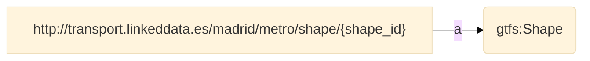
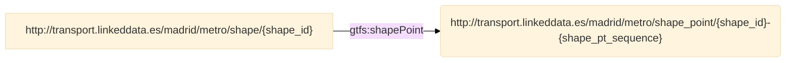
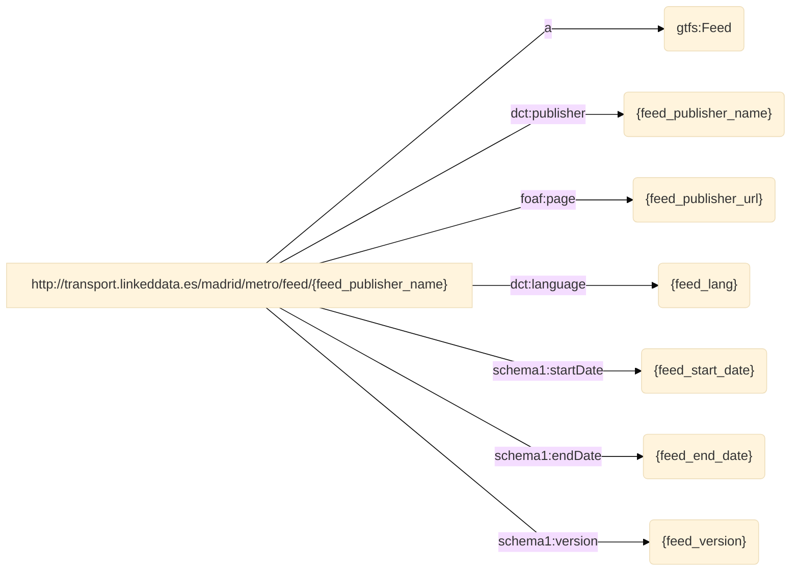
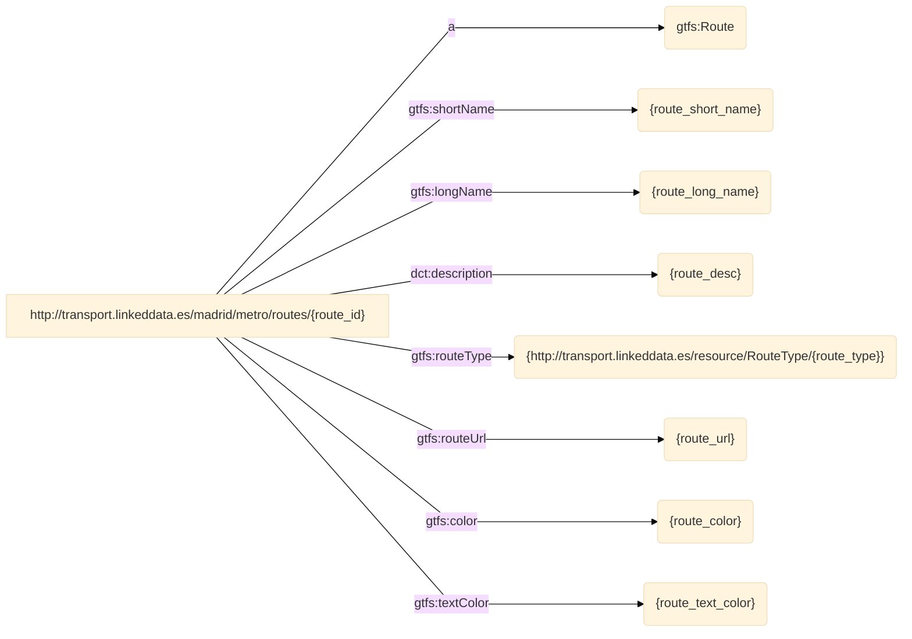
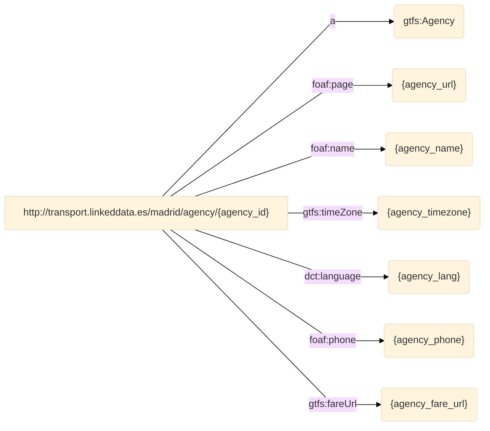

# RML Documentation (RMLdoc)

**Version:**

**Authors**:

* Jhon Toledo Barreto
   
* Ana Iglesias-Molina
   

**Mapping file:**
author.ttl

**License**:

[-blue.svg)](https://creativecommons.org/licenses/by/4.0/)

------


## **Namespaces used in the document**

| Prefix       |               IRI.                   |
| :----------- | :----------------------------------  |
| geo1     | http://www.w3.org/2003/01/geo/wgs84_pos# |
| d2rq     | http://www.wiwiss.fu-berlin.de/suhl/bizer/D2RQ/0.1# |
| formats     | http://www.w3.org/ns/formats/ |
| map     | http://mapping.example.com/ |
| dct     | http://purl.org/dc/terms/ |
| gtfs     | http://vocab.gtfs.org/terms# |
| rml     | http://semweb.mmlab.be/ns/rml# |
| comp     | http://semweb.mmlab.be/ns/rml-compression# |
| schema1     | http://schema.org/ |
| grel     | http://users.ugent.be/~bjdmeest/function/grel.ttl# |
| fnml     | http://semweb.mmlab.be/ns/fnml# |
| ql     | http://semweb.mmlab.be/ns/ql# |
| rr     | http://www.w3.org/ns/r2rml# |
| rev     | http://purl.org/stuff/rev# |


## Mappings
>[!NOTE]
>1. **Source**: This is where you define the source of your data, which can be a relational database, a CSV file, or any other structured data source. The logical source specifies the location and format of your source data.
>2. **Subject**: This part of the mapping defines how the data from the logical source will be used to create RDF subjects, typically using templates and column mappings.
>3. **Predicate Object**: These describe how the data from the logical source will be used to generate RDF triples, indicating relationships between subjects and objects.
>4. **JoinCondition**: is used to specify the conditions under which two data sources or tables should be joined when creating RDF triples through mappings.


## shapes
- **Source**

```bash
/data/SHAPES.csv
``` 
- **Subject**
```bash
http://transport.linkeddata.es/madrid/metro/shape/{shape_id}
``` 
- **Predicate Object**

| Predicate | Object |
|:----------|:-------|
| http://www.w3.org/1999/02/22-rdf-syntax-ns#type | gtfs:Shape |
- **RDF triples**

- **joinCondition**:


  Source triple pattern: <shapes>
  Target triple pattern: <shapePoints>
  Function: **equal(shape_id, shape_id)**



 ## trips
- **Source**

```bash
/data/TRIPS.csv
``` 
- **Subject**
```bash
http://transport.linkeddata.es/madrid/metro/trips/{trip_id}
``` 
- **Predicate Object**

| Predicate | Object |
|:----------|:-------|
| http://www.w3.org/1999/02/22-rdf-syntax-ns#type | gtfs:Trip |
| http://vocab.gtfs.org/terms#headsign | {trip_headsign} |
| http://vocab.gtfs.org/terms#shortName | {trip_short_name} |
| http://vocab.gtfs.org/terms#direction | {direction_id} |
| http://vocab.gtfs.org/terms#block | {block_id} |
| http://vocab.gtfs.org/terms#wheelchairAccessible | {http://transport.linkeddata.es/resource/WheelchairBoardingStatus/{wheelchair_accessible}} |
- **RDF triples**

- **joinCondition**:


  Source triple pattern: <trips>
  Target triple pattern: <services1>
  Function: **equal(service_id, service_id)**


  Source triple pattern: <trips>
  Target triple pattern: <services2>
  Function: **equal(service_id, service_id)**


  Source triple pattern: <trips>
  Target triple pattern: <routes>
  Function: **equal(route_id, route_id)**


  Source triple pattern: <trips>
  Target triple pattern: <shapes>
  Function: **equal(shape_id, shape_id)**


 ## services1
- **Source**

```bash
/data/CALENDAR.csv
``` 
- **Subject**
```bash
http://transport.linkeddata.es/madrid/metro/services/{service_id}
``` 
- **Predicate Object**

| Predicate | Object |
|:----------|:-------|
| http://www.w3.org/1999/02/22-rdf-syntax-ns#type | gtfs:Service |
- **RDF triples**

- **joinCondition**:


  Source triple pattern: <services1>
  Target triple pattern: <calendar_rules>
  Function: **equal(service_id, service_id)**


 ## feed
- **Source**

```bash
/data/FEED_INFO.csv
``` 
- **Subject**
```bash
http://transport.linkeddata.es/madrid/metro/feed/{feed_publisher_name}
``` 
- **Predicate Object**

| Predicate | Object |
|:----------|:-------|
| http://www.w3.org/1999/02/22-rdf-syntax-ns#type | gtfs:Feed |
| http://purl.org/dc/terms/publisher | {feed_publisher_name} |
| http://xmlns.com/foaf/0.1/page | {feed_publisher_url} |
| http://purl.org/dc/terms/language | {feed_lang} |
| http://schema.org/startDate | {feed_start_date} |
| http://schema.org/endDate | {feed_end_date} |
| http://schema.org/version | {feed_version} |
- **RDF triples**

- **joinCondition**:
 ## shapePoints
- **Source**

```bash
/data/SHAPES.csv
``` 
- **Subject**
```bash
http://transport.linkeddata.es/madrid/metro/shape_point/{shape_id}-{shape_pt_sequence}
``` 
- **Predicate Object**

| Predicate | Object |
|:----------|:-------|
| http://www.w3.org/1999/02/22-rdf-syntax-ns#type | gtfs:ShapePoint |
| http://www.w3.org/2003/01/geo/wgs84_pos#lat | {shape_pt_lat} |
| http://www.w3.org/2003/01/geo/wgs84_pos#long | {shape_pt_lon} |
| http://vocab.gtfs.org/terms#pointSequence | {shape_pt_sequence} |
| http://vocab.gtfs.org/terms#distanceTraveled | {shape_dist_traveled} |
- **RDF triples**

- **joinCondition**:
 ## calendar_date_rules
- **Source**

```bash
/data/CALENDAR_DATES.csv
``` 
- **Subject**
```bash
http://transport.linkeddata.es/madrid/metro/calendar_date_rule/{service_id}-{date}
``` 
- **Predicate Object**

| Predicate | Object |
|:----------|:-------|
| http://www.w3.org/1999/02/22-rdf-syntax-ns#type | gtfs:CalendarDateRule |
| http://purl.org/dc/terms/date | {date} |
| http://vocab.gtfs.org/terms#dateAddition | {exception_type} |
- **RDF triples**

- **joinCondition**:
 ## frequencies
- **Source**

```bash
/data/FREQUENCIES.csv
``` 
- **Subject**
```bash
http://transport.linkeddata.es/madrid/metro/frequency/{trip_id}-{start_time}
``` 
- **Predicate Object**

| Predicate | Object |
|:----------|:-------|
| http://www.w3.org/1999/02/22-rdf-syntax-ns#type | gtfs:Frequency |
| http://vocab.gtfs.org/terms#startTime | {start_time} |
| http://vocab.gtfs.org/terms#endTime | {end_time} |
| http://vocab.gtfs.org/terms#headwaySeconds | {headway_secs} |
| http://vocab.gtfs.org/terms#exactTimes | {exact_times} |
- **RDF triples**

- **joinCondition**:


  Source triple pattern: <frequencies>
  Target triple pattern: <trips>
  Function: **equal(trip_id, trip_id)**


 ## stoptimes
- **Source**

```bash
/data/STOP_TIMES.csv
``` 
- **Subject**
```bash
http://transport.linkeddata.es/madrid/metro/stoptimes/{trip_id}-{stop_id}-{arrival_time}
``` 
- **Predicate Object**

| Predicate | Object |
|:----------|:-------|
| http://www.w3.org/1999/02/22-rdf-syntax-ns#type | gtfs:StopTime |
| http://vocab.gtfs.org/terms#arrivalTime | {arrival_time} |
| http://vocab.gtfs.org/terms#departureTime | {departure_time} |
| http://vocab.gtfs.org/terms#stopSequence | {stop_sequence} |
| http://vocab.gtfs.org/terms#headsign | {stop_headsign} |
| http://vocab.gtfs.org/terms#pickupType | {http://transport.linkeddata.es/resource/PickupType/{pickup_type}} |
| http://vocab.gtfs.org/terms#dropOffType | {http://transport.linkeddata.es/resource/DropOffType/{drop_off_type}} |
| http://vocab.gtfs.org/terms#distanceTraveled | {shape_dist_traveled} |
- **RDF triples**

- **joinCondition**:


  Source triple pattern: <stoptimes>
  Target triple pattern: <trips>
  Function: **equal(trip_id, trip_id)**


  Source triple pattern: <stoptimes>
  Target triple pattern: <stops>
  Function: **equal(stop_id, stop_id)**


 ## routes
- **Source**

```bash
/data/ROUTES.csv
``` 
- **Subject**
```bash
http://transport.linkeddata.es/madrid/metro/routes/{route_id}
``` 
- **Predicate Object**

| Predicate | Object |
|:----------|:-------|
| http://www.w3.org/1999/02/22-rdf-syntax-ns#type | gtfs:Route |
| http://vocab.gtfs.org/terms#shortName | {route_short_name} |
| http://vocab.gtfs.org/terms#longName | {route_long_name} |
| http://purl.org/dc/terms/description | {route_desc} |
| http://vocab.gtfs.org/terms#routeType | {http://transport.linkeddata.es/resource/RouteType/{route_type}} |
| http://vocab.gtfs.org/terms#routeUrl | {route_url} |
| http://vocab.gtfs.org/terms#color | {route_color} |
| http://vocab.gtfs.org/terms#textColor | {route_text_color} |
- **RDF triples**

- **joinCondition**:


  Source triple pattern: <routes>
  Target triple pattern: <agency>
  Function: **equal(agency_id, agency_id)**


 ## agency
- **Source**

```bash
/data/AGENCY.csv
``` 
- **Subject**
```bash
http://transport.linkeddata.es/madrid/agency/{agency_id}
``` 
- **Predicate Object**

| Predicate | Object |
|:----------|:-------|
| http://www.w3.org/1999/02/22-rdf-syntax-ns#type | gtfs:Agency |
| http://xmlns.com/foaf/0.1/page | {agency_url} |
| http://xmlns.com/foaf/0.1/name | {agency_name} |
| http://vocab.gtfs.org/terms#timeZone | {agency_timezone} |
| http://purl.org/dc/terms/language | {agency_lang} |
| http://xmlns.com/foaf/0.1/phone | {agency_phone} |
| http://vocab.gtfs.org/terms#fareUrl | {agency_fare_url} |
- **RDF triples**

- **joinCondition**:
 ## calendar_rules
- **Source**

```bash
/data/CALENDAR.csv
``` 
- **Subject**
```bash
http://transport.linkeddata.es/madrid/metro/calendar_rules/{service_id}
``` 
- **Predicate Object**

| Predicate | Object |
|:----------|:-------|
| http://www.w3.org/1999/02/22-rdf-syntax-ns#type | gtfs:CalendarRule |
| http://vocab.gtfs.org/terms#monday | {monday} |
| http://vocab.gtfs.org/terms#tuesday | {tuesday} |
| http://vocab.gtfs.org/terms#wednesday | {wednesday} |
| http://vocab.gtfs.org/terms#thursday | {thursday} |
| http://vocab.gtfs.org/terms#friday | {friday} |
| http://vocab.gtfs.org/terms#saturday | {saturday} |
| http://vocab.gtfs.org/terms#sunday | {sunday} |
| http://schema.org/startDate | {start_date} |
| http://schema.org/endDate | {end_date} |
- **RDF triples**
```mermaid
%%{ init : { "theme" : "base", "flowchart" : { "curve" : "linear" }}}%%
flowchart LR
S["http://transport.linkeddata.es/madrid/metro/calendar_rules/{service_id}"] -->|"a"| object1("gtfs:CalendarRule")
S["http://transport.linkeddata.es/madrid/metro/calendar_rules/{service_id}"] -->|"gtfs:monday"| object2("{monday}")
S["http://transport.linkeddata.es/madrid/metro/calendar_rules/{service_id}"] -->|"gtfs:tuesday"| object3("{tuesday}")
S["http://transport.linkeddata.es/madrid/metro/calendar_rules/{service_id}"] -->|"gtfs:wednesday"| object4("{wednesday}")
S["http://transport.linkeddata.es/madrid/metro/calendar_rules/{service_id}"] -->|"gtfs:thursday"| object5("{thursday}")
S["http://transport.linkeddata.es/madrid/metro/calendar_rules/{service_id}"] -->|"gtfs:friday"| object6("{friday}")
S["http://transport.linkeddata.es/madrid/metro/calendar_rules/{service_id}"] -->|"gtfs:saturday"| object7("{saturday}")
S["http://transport.linkeddata.es/madrid/metro/calendar_rules/{service_id}"] -->|"gtfs:sunday"| object8("{sunday}")
S["http://transport.linkeddata.es/madrid/metro/calendar_rules/{service_id}"] -->|"schema1:startDate"| object9("{start_date}")
S["http://transport.linkeddata.es/madrid/metro/calendar_rules/{service_id}"] -->|"schema1:endDate"| object10("{end_date}")
    
``` 
- **joinCondition**:
 ## stops
- **Source**

```bash
/data/STOPS.csv
``` 
- **Subject**
```bash
http://transport.linkeddata.es/madrid/metro/stops/{stop_id}
``` 
- **Predicate Object**

| Predicate | Object |
|:----------|:-------|
| http://www.w3.org/1999/02/22-rdf-syntax-ns#type | gtfs:Stop |
| http://vocab.gtfs.org/terms#code | {stop_code} |
| http://purl.org/dc/terms/identifier | {stop_id} |
| http://xmlns.com/foaf/0.1/name | {stop_name} |
| http://purl.org/dc/terms/description | {stop_desc} |
| http://www.w3.org/2003/01/geo/wgs84_pos#lat | {stop_lat} |
| http://www.w3.org/2003/01/geo/wgs84_pos#long | {stop_lon} |
| http://vocab.gtfs.org/terms#zone | {zone_id} |
| http://xmlns.com/foaf/0.1/page | {stop_url} |
| http://vocab.gtfs.org/terms#locationType | {http://transport.linkeddata.es/resource/LocationType/{location_type}} |
| http://vocab.gtfs.org/terms#timeZone | {stop_timezone} |
| http://vocab.gtfs.org/terms#wheelchairAccessible | {http://transport.linkeddata.es/resource/WheelchairBoardingStatus/{wheelchair_boarding}} |
- **RDF triples**
```mermaid
%%{ init : { "theme" : "base", "flowchart" : { "curve" : "linear" }}}%%
flowchart LR
S["http://transport.linkeddata.es/madrid/metro/stops/{stop_id}"] -->|"a"| object1("gtfs:Stop")
S["http://transport.linkeddata.es/madrid/metro/stops/{stop_id}"] -->|"gtfs:code"| object2("{stop_code}")
S["http://transport.linkeddata.es/madrid/metro/stops/{stop_id}"] -->|"dct:identifier"| object3("{stop_id}")
S["http://transport.linkeddata.es/madrid/metro/stops/{stop_id}"] -->|"foaf:name"| object4("{stop_name}")
S["http://transport.linkeddata.es/madrid/metro/stops/{stop_id}"] -->|"dct:description"| object5("{stop_desc}")
S["http://transport.linkeddata.es/madrid/metro/stops/{stop_id}"] -->|"geo1:lat"| object6("{stop_lat}")
S["http://transport.linkeddata.es/madrid/metro/stops/{stop_id}"] -->|"geo1:long"| object7("{stop_lon}")
S["http://transport.linkeddata.es/madrid/metro/stops/{stop_id}"] -->|"gtfs:zone"| object8("{zone_id}")
S["http://transport.linkeddata.es/madrid/metro/stops/{stop_id}"] -->|"foaf:page"| object9("{stop_url}")
S["http://transport.linkeddata.es/madrid/metro/stops/{stop_id}"] -->|"gtfs:locationType"| object10("{http://transport.linkeddata.es/resource/LocationType/{location_type}}")
S["http://transport.linkeddata.es/madrid/metro/stops/{stop_id}"] -->|"gtfs:timeZone"| object11("{stop_timezone}")
S["http://transport.linkeddata.es/madrid/metro/stops/{stop_id}"] -->|"gtfs:wheelchairAccessible"| object12("{http://transport.linkeddata.es/resource/WheelchairBoardingStatus/{wheelchair_boarding}}")
    
``` 
- **joinCondition**:


  Source triple pattern: <stops>
  Target triple pattern: <stops>
  Function: **equal(parent_station, stop_id)**

```mermaid
%%{ init : { "theme" : "base", "flowchart" : { "curve" : "linear" }}}%%

flowchart LR
S1["http://transport.linkeddata.es/madrid/metro/stops/{stop_id}"] -->|"gtfs:parentStation"| object1("http://transport.linkeddata.es/madrid/metro/stops/{stop_id}")

``` 

 ## services2
- **Source**

```bash
/data/CALENDAR_DATES.csv
``` 
- **Subject**
```bash
http://transport.linkeddata.es/madrid/metro/services/{service_id}
``` 
- **Predicate Object**

| Predicate | Object |
|:----------|:-------|
| http://www.w3.org/1999/02/22-rdf-syntax-ns#type | gtfs:Service |
- **RDF triples**
```mermaid
%%{ init : { "theme" : "base", "flowchart" : { "curve" : "linear" }}}%%
flowchart LR
S["http://transport.linkeddata.es/madrid/metro/services/{service_id}"] -->|"a"| object1("gtfs:Service")
    
``` 
- **joinCondition**:


  Source triple pattern: <services2>
  Target triple pattern: <calendar_date_rules>
  Function: **equal(service_id, service_id)**

```mermaid
%%{ init : { "theme" : "base", "flowchart" : { "curve" : "linear" }}}%%

flowchart LR
S1["http://transport.linkeddata.es/madrid/metro/services/{service_id}"] -->|"gtfs:serviceRule"| object1("http://transport.linkeddata.es/madrid/metro/calendar_date_rule/{service_id}-{date}")

``` 

 


----

**Copyright © 2024** *[Ontology Engineering Group](https://oeg.fi.upm.es/)*, *[Universidad Politécnica de Madrid](https://www.upm.es/internacional)*.
