# Mapping Documentation
   
**Version:**

**Authors**:


**Mapping file:**
ppds.rml.ttl


**License**:

[-blue.svg)](https://creativecommons.org/licenses/by/4.0/)


------


## **Namespaces used in the document**

| Prefix       |               IRI.                   |
| :----------- | :----------------------------------  |
| rr     | http://www.w3.org/ns/r2rml# |
| fnml     | http://semweb.mmlab.be/ns/fnml# |
| schema1     | http://schema.org/ |
| rml     | http://semweb.mmlab.be/ns/rml# |
| formats     | http://www.w3.org/ns/formats/ |
| geo1     | http://www.w3.org/2003/01/geo/wgs84_pos# |
| comp     | http://semweb.mmlab.be/ns/rml-compression# |
| legal     | https://www.w3.org/ns/legal# |
| grel     | http://users.ugent.be/~bjdmeest/function/grel.ttl# |
| ql     | http://semweb.mmlab.be/ns/ql# |
| epo     | http://data.europa.eu/a4g/ontology# |
| locn     | http://www.w3.org/ns/locn# |
| d2rq     | http://www.wiwiss.fu-berlin.de/suhl/bizer/D2RQ/0.1# |
| dct     | http://purl.org/dc/terms/ |


## Mappings
>[!NOTE]
>1. **Source**: This is where you define the source of your data, which can be a relational database, a CSV file, or any other structured data source. The logical source specifies the location and format of your source data.
>2. **Subject**: This part of the mapping defines how the data from the logical source will be used to create RDF subjects, typically using templates and column mappings.
>3. **Predicate Object**: These describe how the data from the logical source will be used to generate RDF triples, indicating relationships between subjects and objects.
>4. **JoinCondition**: is used to specify the conditions under which two data sources or tables should be joined when creating RDF triples through mappings.


## lot_award_outcome_0
- **Source**

```bash
spanish_data.xml
``` 
- **Subject**
```bash
http://data.europa.eu/a4g/resource/epo/lotAwardOutcome/codice_{replace(../../id,'https://contrataciondelestado.es/sindicacion/licitacionesPerfilContratante/','')}_{cac:AwardedTenderedProject/cbc:ProcurementProjectLotID}
``` 
- **Predicate Object**

| Predicate | Object |
|:----------|:-------|
| a | epo:LotAwardOutcome |
| epo:hasAwardDecisionDate | {cbc:AwardDate} |
- **RDF triples**
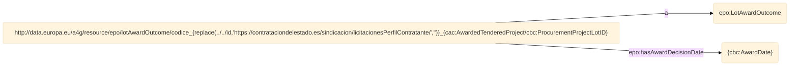


- **Join Condition**:
    - Source triples map: **lot_award_outcome_0**
    - Target triples map: **lot_0**
    - Function: **equal(../../id, ../../id)**

```mermaid
%%{ init : { "theme" : "base", "flowchart" : { "curve" : "linear" }}}%%

flowchart LR
S1["http://data.europa.eu/a4g/resource/epo/lotAwardOutcome/codice_{replace(../../id,'https://contrataciondelestado.es/sindicacion/licitacionesPerfilContratante/','')}_{cac:AwardedTenderedProject/cbc:ProcurementProjectLotID}"] -->|"epo:describesLot"| object1("http://data.europa.eu/a4g/resource/epo/lot/codice_{replace(../../id,'https://contrataciondelestado.es/sindicacion/licitacionesPerfilContratante/','')}_{cbc:ID[@schemeName='ID_LOTE']}")

``` 


- **Join Condition**:
    - Source triples map: **lot_award_outcome_0**
    - Target triples map: **lot_0**
    - Function: **equal(cac:AwardedTenderedProject/cbc:ProcurementProjectLotID, cbc:ID[@schemeName="ID_LOTE"])**


 ## lot_adhoc_0
- **Source**

```bash
spanish_data.xml
``` 
- **Subject**
```bash
http://data.europa.eu/a4g/resource/epo/lot/codice_{replace(../id,'https://contrataciondelestado.es/sindicacion/licitacionesPerfilContratante/','')}_0
``` 
- **Predicate Object**

| Predicate | Object |
|:----------|:-------|
| a | epo:Lot |
- **RDF triples**
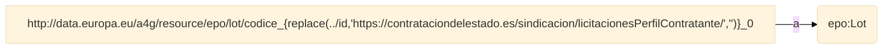
## lot_0
- **Source**

```bash
spanish_data.xml
``` 
- **Subject**
```bash
http://data.europa.eu/a4g/resource/epo/lot/codice_{replace(../../id,'https://contrataciondelestado.es/sindicacion/licitacionesPerfilContratante/','')}_{cbc:ID[@schemeName="ID_LOTE"]}
``` 
- **Predicate Object**

| Predicate | Object |
|:----------|:-------|
| a | epo:Lot |
- **RDF triples**
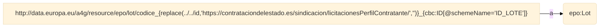
## organization_0
- **Source**

```bash
spanish_data.xml
``` 
- **Subject**
```bash
http://data.europa.eu/a4g/resource/org/organization/{cac:PartyIdentification/cbc:ID[@schemeName="DIR3"]}
``` 
- **Predicate Object**

| Predicate | Object |
|:----------|:-------|
| a | org:Organization |
- **RDF triples**


- **Join Condition**:
    - Source triples map: **organization_0**
    - Target triples map: **organization_id_0**
    - Function: **equal(cac:PartyIdentification/cbc:ID[@schemeName="DIR3"], cac:PartyIdentification/cbc:ID[@schemeName="DIR3"])**

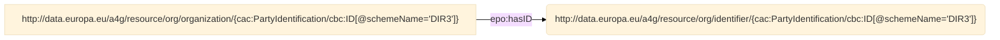


- **Join Condition**:
    - Source triples map: **organization_0**
    - Target triples map: **buyer_legal_type_0**
    - Function: **equal(cbc:ContractingPartyTypeCode, codice)**

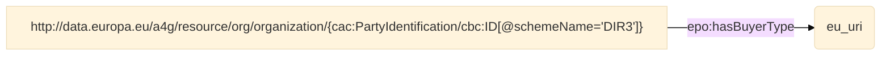


- **Join Condition**:
    - Source triples map: **organization_0**
    - Target triples map: **locn_address_0**
    - Function: **equal(cac:PartyIdentification/cbc:ID[@schemeName="DIR3"], ../cac:PartyIdentification/cbc:ID[@schemeName="DIR3"])**

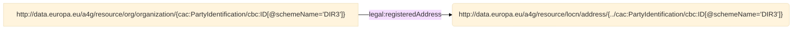

 ## buyer_legal_type_0
- **Source**

```bash
buyer_legal_type.csv
``` 
- **Subject**
```bash
eu_uri
``` 
## result_notice_0
- **Source**

```bash
spanish_data.xml
``` 
- **Subject**
```bash
http://data.europa.eu/a4g/resource/epo/resultNotice/codice_{replace(../id,'https://contrataciondelestado.es/sindicacion/licitacionesPerfilContratante/','')}
``` 
- **Predicate Object**

| Predicate | Object |
|:----------|:-------|
| a | epo:ResultNotice |
| epo:hasDispatchDate | {cac:TenderingProcess/cac:TenderSubmissionDeadlinePeriod/cbc:EndDate} |
- **RDF triples**
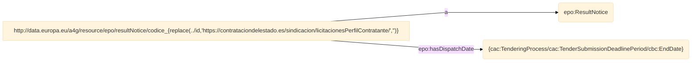


- **Join Condition**:
    - Source triples map: **result_notice_0**
    - Target triples map: **buyer_role_0**
    - Function: **equal(../id, ../id)**

```mermaid
%%{ init : { "theme" : "base", "flowchart" : { "curve" : "linear" }}}%%

flowchart LR
S1["http://data.europa.eu/a4g/resource/epo/resultNotice/codice_{replace(../id,'https://contrataciondelestado.es/sindicacion/licitacionesPerfilContratante/','')}"] -->|"epo:refersToRole"| object1("http://data.europa.eu/a4g/resource/epo/buyer/codice_{replace(../id,'https://contrataciondelestado.es/sindicacion/licitacionesPerfilContratante/','')}")

``` 


- **Join Condition**:
    - Source triples map: **result_notice_0**
    - Target triples map: **procedure_0**
    - Function: **equal(../id, ../../id)**

```mermaid
%%{ init : { "theme" : "base", "flowchart" : { "curve" : "linear" }}}%%

flowchart LR
S2["http://data.europa.eu/a4g/resource/epo/resultNotice/codice_{replace(../id,'https://contrataciondelestado.es/sindicacion/licitacionesPerfilContratante/','')}"] -->|"epo:refersToProcedure"| object2("http://data.europa.eu/a4g/resource/epo/procedure/codice_{replace(../../id,'https://contrataciondelestado.es/sindicacion/licitacionesPerfilContratante/','')}")

``` 


- **Join Condition**:
    - Source triples map: **result_notice_0**
    - Target triples map: **procedure_no_lot_0**
    - Function: **equal(../id, ../id)**

```mermaid
%%{ init : { "theme" : "base", "flowchart" : { "curve" : "linear" }}}%%

flowchart LR
S3["http://data.europa.eu/a4g/resource/epo/resultNotice/codice_{replace(../id,'https://contrataciondelestado.es/sindicacion/licitacionesPerfilContratante/','')}"] -->|"epo:refersToProcedure"| object3("http://data.europa.eu/a4g/resource/epo/procedure/codice_{replace(../id,'https://contrataciondelestado.es/sindicacion/licitacionesPerfilContratante/','')}")

``` 

 ## locn_address_0
- **Source**

```bash
spanish_data.xml
``` 
- **Subject**
```bash
http://data.europa.eu/a4g/resource/locn/address/{../cac:PartyIdentification/cbc:ID[@schemeName="DIR3"]}
``` 
- **Predicate Object**

| Predicate | Object |
|:----------|:-------|
| a | locn:Address |
- **RDF triples**


- **Join Condition**:
    - Source triples map: **locn_address_0**
    - Target triples map: **country_code_0**
    - Function: **equal(cac:Country/cbc:IdentificationCode, codice)**

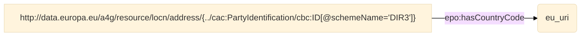

 ## buyer_role_0
- **Source**

```bash
spanish_data.xml
``` 
- **Subject**
```bash
http://data.europa.eu/a4g/resource/epo/buyer/codice_{replace(../id,'https://contrataciondelestado.es/sindicacion/licitacionesPerfilContratante/','')}
``` 
- **Predicate Object**

| Predicate | Object |
|:----------|:-------|
| a | epo:Buyer |
- **RDF triples**


- **Join Condition**:
    - Source triples map: **buyer_role_0**
    - Target triples map: **organization_0**
    - Function: **equal(../id, ../../../id)**

```mermaid
%%{ init : { "theme" : "base", "flowchart" : { "curve" : "linear" }}}%%

flowchart LR
S1["http://data.europa.eu/a4g/resource/epo/buyer/codice_{replace(../id,'https://contrataciondelestado.es/sindicacion/licitacionesPerfilContratante/','')}"] -->|"epo:playedBy"| object1("http://data.europa.eu/a4g/resource/org/organization/{cac:PartyIdentification/cbc:ID[@schemeName='DIR3']}")

``` 

 ## procedure_type_0
- **Source**

```bash
procedure_type.csv
``` 
- **Subject**
```bash
eu_uri
``` 
## procedure_framework_agreement_technique_usage_0
- **Source**

```bash
spanish_data.xml
``` 
- **Subject**
```bash
http://data.europa.eu/a4g/resource/epo/procedure/codice_{replace(../../../id,'https://contrataciondelestado.es/sindicacion/licitacionesPerfilContratante/','')}
``` 
- **Predicate Object**

| Predicate | Object |
|:----------|:-------|
| epo:usesTechnique | http://data.europa.eu/a4g/resource/epo/frameworkAgreementTechniqueUsage/codice_{replace(../../../id,'https://contrataciondelestado.es/sindicacion/licitacionesPerfilContratante/','')} |
- **RDF triples**
```mermaid
%%{ init : { "theme" : "base", "flowchart" : { "curve" : "linear" }}}%%
flowchart LR
S["http://data.europa.eu/a4g/resource/epo/procedure/codice_{replace(../../../id,'https://contrataciondelestado.es/sindicacion/licitacionesPerfilContratante/','')}"] -->|"epo:usesTechnique"| object1("http://data.europa.eu/a4g/resource/epo/frameworkAgreementTechniqueUsage/codice_{replace(../../../id,'https://contrataciondelestado.es/sindicacion/licitacionesPerfilContratante/','')}")
    
``` 
## framework_agreement_technique_usage_0
- **Source**

```bash
spanish_data.xml
``` 
- **Subject**
```bash
http://data.europa.eu/a4g/resource/epo/frameworkAgreementTechniqueUsage/codice_{replace(../../../id,'https://contrataciondelestado.es/sindicacion/licitacionesPerfilContratante/','')}
``` 
- **Predicate Object**

| Predicate | Object |
|:----------|:-------|
| a | epo:FrameworkAgreementTechniqueUsage |
| a | epo:TechniqueUsage |
- **RDF triples**
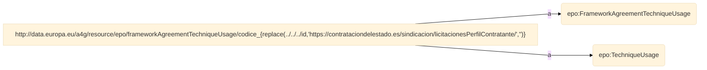
## procedure_0
- **Source**

```bash
spanish_data.xml
``` 
- **Subject**
```bash
http://data.europa.eu/a4g/resource/epo/procedure/codice_{replace(../../id,'https://contrataciondelestado.es/sindicacion/licitacionesPerfilContratante/','')}
``` 
- **Predicate Object**

| Predicate | Object |
|:----------|:-------|
| a | epo:Procedure |
- **RDF triples**


- **Join Condition**:
    - Source triples map: **procedure_0**
    - Target triples map: **lot_0**
    - Function: **equal(../../id, ../../id)**

```mermaid
%%{ init : { "theme" : "base", "flowchart" : { "curve" : "linear" }}}%%

flowchart LR
S1["http://data.europa.eu/a4g/resource/epo/procedure/codice_{replace(../../id,'https://contrataciondelestado.es/sindicacion/licitacionesPerfilContratante/','')}"] -->|"epo:hasProcurementScopeDividedIntoLot"| object1("http://data.europa.eu/a4g/resource/epo/lot/codice_{replace(../../id,'https://contrataciondelestado.es/sindicacion/licitacionesPerfilContratante/','')}_{cbc:ID[@schemeName='ID_LOTE']}")

``` 


- **Join Condition**:
    - Source triples map: **procedure_0**
    - Target triples map: **procedure_type_0**
    - Function: **equal(../cac:ProcurementProject/cbc:TypeCode, codice)**

```mermaid
%%{ init : { "theme" : "base", "flowchart" : { "curve" : "linear" }}}%%

flowchart LR
S2["http://data.europa.eu/a4g/resource/epo/procedure/codice_{replace(../../id,'https://contrataciondelestado.es/sindicacion/licitacionesPerfilContratante/','')}"] -->|"epo:hasProcedureType"| object2("eu_uri")

``` 


- **Join Condition**:
    - Source triples map: **procedure_0**
    - Target triples map: **framework_agreement_technique_usage_0**
    - Function: **equal(../../id, ../../id)**

```mermaid
%%{ init : { "theme" : "base", "flowchart" : { "curve" : "linear" }}}%%

flowchart LR
S3["http://data.europa.eu/a4g/resource/epo/procedure/codice_{replace(../../id,'https://contrataciondelestado.es/sindicacion/licitacionesPerfilContratante/','')}"] -->|"epo:usesTechnique"| object3("http://data.europa.eu/a4g/resource/epo/frameworkAgreementTechniqueUsage/codice_{replace(../../../id,'https://contrataciondelestado.es/sindicacion/licitacionesPerfilContratante/','')}")

``` 


- **Join Condition**:
    - Source triples map: **procedure_0**
    - Target triples map: **technique_usage_0**
    - Function: **equal(../../id, ../../id)**

```mermaid
%%{ init : { "theme" : "base", "flowchart" : { "curve" : "linear" }}}%%

flowchart LR
S4["http://data.europa.eu/a4g/resource/epo/procedure/codice_{replace(../../id,'https://contrataciondelestado.es/sindicacion/licitacionesPerfilContratante/','')}"] -->|"epo:usesTechnique"| object4("http://data.europa.eu/a4g/resource/epo/techniqueUsage/codice_{replace(../../../id,'https://contrataciondelestado.es/sindicacion/licitacionesPerfilContratante/','')}")

``` 

 ## procedure_technique_usage_0
- **Source**

```bash
spanish_data.xml
``` 
- **Subject**
```bash
http://data.europa.eu/a4g/resource/epo/procedure/codice_{replace(../../../id,'https://contrataciondelestado.es/sindicacion/licitacionesPerfilContratante/','')}
``` 
- **Predicate Object**

| Predicate | Object |
|:----------|:-------|
| epo:usesTechnique | http://data.europa.eu/a4g/resource/epo/techniqueUsage/codice_{replace(../../../id,'https://contrataciondelestado.es/sindicacion/licitacionesPerfilContratante/','')} |
- **RDF triples**
```mermaid
%%{ init : { "theme" : "base", "flowchart" : { "curve" : "linear" }}}%%
flowchart LR
S["http://data.europa.eu/a4g/resource/epo/procedure/codice_{replace(../../../id,'https://contrataciondelestado.es/sindicacion/licitacionesPerfilContratante/','')}"] -->|"epo:usesTechnique"| object1("http://data.europa.eu/a4g/resource/epo/techniqueUsage/codice_{replace(../../../id,'https://contrataciondelestado.es/sindicacion/licitacionesPerfilContratante/','')}")
    
``` 
## not_lot_submission_statistical_information_0
- **Source**

```bash
spanish_data.xml
``` 
- **Subject**
```bash
http://data.europa.eu/a4g/resource/epo/submissionStatisticalInformation/codice_{replace(../id,'https://contrataciondelestado.es/sindicacion/licitacionesPerfilContratante/','')}_0
``` 
- **Predicate Object**

| Predicate | Object |
|:----------|:-------|
| a | epo:SubmissionStatisticalInformation |
| epo:hasReceivedTenders | {cac:TenderResult/cbc:ReceivedTenderQuantity} |
| epo:concernsSubmissionsForLot | http://data.europa.eu/a4g/resource/epo/lot/codice_{replace(../id,'https://contrataciondelestado.es/sindicacion/licitacionesPerfilContratante/','')}_0 |
- **RDF triples**
```mermaid
%%{ init : { "theme" : "base", "flowchart" : { "curve" : "linear" }}}%%
flowchart LR
S["http://data.europa.eu/a4g/resource/epo/submissionStatisticalInformation/codice_{replace(../id,'https://contrataciondelestado.es/sindicacion/licitacionesPerfilContratante/','')}_0"] -->|"a"| object1("epo:SubmissionStatisticalInformation")
S["http://data.europa.eu/a4g/resource/epo/submissionStatisticalInformation/codice_{replace(../id,'https://contrataciondelestado.es/sindicacion/licitacionesPerfilContratante/','')}_0"] -->|"epo:hasReceivedTenders"| object2("{cac:TenderResult/cbc:ReceivedTenderQuantity}")
S["http://data.europa.eu/a4g/resource/epo/submissionStatisticalInformation/codice_{replace(../id,'https://contrataciondelestado.es/sindicacion/licitacionesPerfilContratante/','')}_0"] -->|"epo:concernsSubmissionsForLot"| object3("http://data.europa.eu/a4g/resource/epo/lot/codice_{replace(../id,'https://contrataciondelestado.es/sindicacion/licitacionesPerfilContratante/','')}_0")
    
``` 
## not_lot_award_outcome_0
- **Source**

```bash
spanish_data.xml
``` 
- **Subject**
```bash
http://data.europa.eu/a4g/resource/epo/lotAwardOutcome/codice_{replace(../id,'https://contrataciondelestado.es/sindicacion/licitacionesPerfilContratante/','')}_0
``` 
- **Predicate Object**

| Predicate | Object |
|:----------|:-------|
| a | epo:LotAwardOutcome |
| epo:hasAwardDecisionDate | {cac:TenderResult/cbc:AwardDate} |
| epo:describesLot | http://data.europa.eu/a4g/resource/epo/lot/codice_{replace(../id,'https://contrataciondelestado.es/sindicacion/licitacionesPerfilContratante/','')}_0 |
- **RDF triples**
```mermaid
%%{ init : { "theme" : "base", "flowchart" : { "curve" : "linear" }}}%%
flowchart LR
S["http://data.europa.eu/a4g/resource/epo/lotAwardOutcome/codice_{replace(../id,'https://contrataciondelestado.es/sindicacion/licitacionesPerfilContratante/','')}_0"] -->|"a"| object1("epo:LotAwardOutcome")
S["http://data.europa.eu/a4g/resource/epo/lotAwardOutcome/codice_{replace(../id,'https://contrataciondelestado.es/sindicacion/licitacionesPerfilContratante/','')}_0"] -->|"epo:hasAwardDecisionDate"| object2("{cac:TenderResult/cbc:AwardDate}")
S["http://data.europa.eu/a4g/resource/epo/lotAwardOutcome/codice_{replace(../id,'https://contrataciondelestado.es/sindicacion/licitacionesPerfilContratante/','')}_0"] -->|"epo:describesLot"| object3("http://data.europa.eu/a4g/resource/epo/lot/codice_{replace(../id,'https://contrataciondelestado.es/sindicacion/licitacionesPerfilContratante/','')}_0")
    
``` 
## country_code_0
- **Source**

```bash
country_code.csv
``` 
- **Subject**
```bash
eu_uri
``` 
## organization_id_0
- **Source**

```bash
spanish_data.xml
``` 
- **Subject**
```bash
http://data.europa.eu/a4g/resource/org/identifier/{cac:PartyIdentification/cbc:ID[@schemeName="DIR3"]}
``` 
- **Predicate Object**

| Predicate | Object |
|:----------|:-------|
| a | epo:Identifier |
| epo:hasIdentifierValue | {cac:PartyIdentification/cbc:ID[@schemeName='DIR3']} |
- **RDF triples**
```mermaid
%%{ init : { "theme" : "base", "flowchart" : { "curve" : "linear" }}}%%
flowchart LR
S["http://data.europa.eu/a4g/resource/org/identifier/{cac:PartyIdentification/cbc:ID[@schemeName='DIR3']}"] -->|"a"| object1("epo:Identifier")
S["http://data.europa.eu/a4g/resource/org/identifier/{cac:PartyIdentification/cbc:ID[@schemeName='DIR3']}"] -->|"epo:hasIdentifierValue"| object2("{cac:PartyIdentification/cbc:ID[@schemeName='DIR3']}")
    
``` 
## technique_usage_0
- **Source**

```bash
spanish_data.xml
``` 
- **Subject**
```bash
http://data.europa.eu/a4g/resource/epo/techniqueUsage/codice_{replace(../../../id,'https://contrataciondelestado.es/sindicacion/licitacionesPerfilContratante/','')}
``` 
- **Predicate Object**

| Predicate | Object |
|:----------|:-------|
| a | epo:TechniqueUsage |
- **RDF triples**
```mermaid
%%{ init : { "theme" : "base", "flowchart" : { "curve" : "linear" }}}%%
flowchart LR
S["http://data.europa.eu/a4g/resource/epo/techniqueUsage/codice_{replace(../../../id,'https://contrataciondelestado.es/sindicacion/licitacionesPerfilContratante/','')}"] -->|"a"| object1("epo:TechniqueUsage")
    
``` 
## submission_statistical_information_0
- **Source**

```bash
spanish_data.xml
``` 
- **Subject**
```bash
http://data.europa.eu/a4g/resource/epo/submissionStatisticalInformation/codice_{replace(../../id,'https://contrataciondelestado.es/sindicacion/licitacionesPerfilContratante/','')}_{cac:AwardedTenderedProject/cbc:ProcurementProjectLotID}
``` 
- **Predicate Object**

| Predicate | Object |
|:----------|:-------|
| a | epo:SubmissionStatisticalInformation |
| epo:hasReceivedTenders | {cbc:ReceivedTenderQuantity} |
- **RDF triples**
```mermaid
%%{ init : { "theme" : "base", "flowchart" : { "curve" : "linear" }}}%%
flowchart LR
S["http://data.europa.eu/a4g/resource/epo/submissionStatisticalInformation/codice_{replace(../../id,'https://contrataciondelestado.es/sindicacion/licitacionesPerfilContratante/','')}_{cac:AwardedTenderedProject/cbc:ProcurementProjectLotID}"] -->|"a"| object1("epo:SubmissionStatisticalInformation")
S["http://data.europa.eu/a4g/resource/epo/submissionStatisticalInformation/codice_{replace(../../id,'https://contrataciondelestado.es/sindicacion/licitacionesPerfilContratante/','')}_{cac:AwardedTenderedProject/cbc:ProcurementProjectLotID}"] -->|"epo:hasReceivedTenders"| object2("{cbc:ReceivedTenderQuantity}")
    
``` 


- **Join Condition**:
    - Source triples map: **submission_statistical_information_0**
    - Target triples map: **lot_0**
    - Function: **equal(../../id, ../../id)**

```mermaid
%%{ init : { "theme" : "base", "flowchart" : { "curve" : "linear" }}}%%

flowchart LR
S1["http://data.europa.eu/a4g/resource/epo/submissionStatisticalInformation/codice_{replace(../../id,'https://contrataciondelestado.es/sindicacion/licitacionesPerfilContratante/','')}_{cac:AwardedTenderedProject/cbc:ProcurementProjectLotID}"] -->|"epo:concernsSubmissionsForLot"| object1("http://data.europa.eu/a4g/resource/epo/lot/codice_{replace(../../id,'https://contrataciondelestado.es/sindicacion/licitacionesPerfilContratante/','')}_{cbc:ID[@schemeName='ID_LOTE']}")

``` 


- **Join Condition**:
    - Source triples map: **submission_statistical_information_0**
    - Target triples map: **lot_0**
    - Function: **equal(cac:AwardedTenderedProject/cbc:ProcurementProjectLotID, cbc:ID[@schemeName="ID_LOTE"])**

```mermaid
%%{ init : { "theme" : "base", "flowchart" : { "curve" : "linear" }}}%%

flowchart LR
S2["http://data.europa.eu/a4g/resource/epo/submissionStatisticalInformation/codice_{replace(../../id,'https://contrataciondelestado.es/sindicacion/licitacionesPerfilContratante/','')}_{cac:AwardedTenderedProject/cbc:ProcurementProjectLotID}"] -->|"epo:concernsSubmissionsForLot"| object2("http://data.europa.eu/a4g/resource/epo/lot/codice_{replace(../../id,'https://contrataciondelestado.es/sindicacion/licitacionesPerfilContratante/','')}_{cbc:ID[@schemeName='ID_LOTE']}")

``` 

 ## procedure_no_lot_0
- **Source**

```bash
spanish_data.xml
``` 
- **Subject**
```bash
http://data.europa.eu/a4g/resource/epo/procedure/codice_{replace(../id,'https://contrataciondelestado.es/sindicacion/licitacionesPerfilContratante/','')}
``` 
- **Predicate Object**

| Predicate | Object |
|:----------|:-------|
| a | epo:Procedure |
| epo:hasProcurementScopeDividedIntoLot | http://data.europa.eu/a4g/resource/epo/lot/codice_{replace(../id,'https://contrataciondelestado.es/sindicacion/licitacionesPerfilContratante/','')}_0 |
- **RDF triples**
```mermaid
%%{ init : { "theme" : "base", "flowchart" : { "curve" : "linear" }}}%%
flowchart LR
S["http://data.europa.eu/a4g/resource/epo/procedure/codice_{replace(../id,'https://contrataciondelestado.es/sindicacion/licitacionesPerfilContratante/','')}"] -->|"a"| object1("epo:Procedure")
S["http://data.europa.eu/a4g/resource/epo/procedure/codice_{replace(../id,'https://contrataciondelestado.es/sindicacion/licitacionesPerfilContratante/','')}"] -->|"epo:hasProcurementScopeDividedIntoLot"| object2("http://data.europa.eu/a4g/resource/epo/lot/codice_{replace(../id,'https://contrataciondelestado.es/sindicacion/licitacionesPerfilContratante/','')}_0")
    
``` 


- **Join Condition**:
    - Source triples map: **procedure_no_lot_0**
    - Target triples map: **procedure_type_0**
    - Function: **equal(cac:ProcurementProject/cbc:TypeCode, codice)**

```mermaid
%%{ init : { "theme" : "base", "flowchart" : { "curve" : "linear" }}}%%

flowchart LR
S1["http://data.europa.eu/a4g/resource/epo/procedure/codice_{replace(../id,'https://contrataciondelestado.es/sindicacion/licitacionesPerfilContratante/','')}"] -->|"epo:hasProcedureType"| object1("eu_uri")

``` 

 


----

**This documentation was generated using**  *[RMLdoc](https://oeg-upm.github.io/rmldoc/)*.
