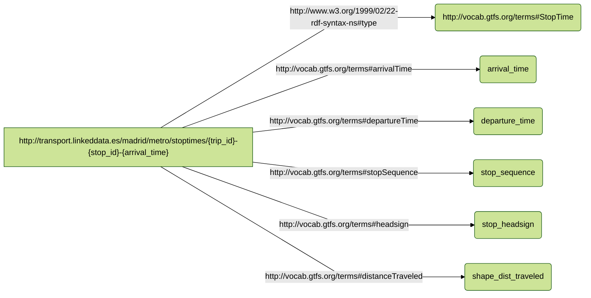
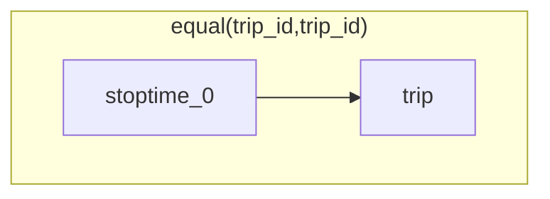

# RDF Mapping Documentation (RMD)

**Version:**

**Authors**:

* John Doe


**License**:

[-blue.svg)](https://creativecommons.org/licenses/by/4.0/)

------


## **Namespaces used in the document**

| Prefix       |               IRI.                   |
| :----------- | :----------------------------------  |
| brick     | https://brickschema.org/schema/Brick# |
| csvw     | http://www.w3.org/ns/csvw# |
| dc     | http://purl.org/dc/elements/1.1/ |
| dcat     | http://www.w3.org/ns/dcat# |
| dcmitype     | http://purl.org/dc/dcmitype/ |
| dcam     | http://purl.org/dc/dcam/ |
| doap     | http://usefulinc.com/ns/doap# |
| foaf     | http://xmlns.com/foaf/0.1/ |
| geo     | http://www.opengis.net/ont/geosparql# |
| odrl     | http://www.w3.org/ns/odrl/2/ |
| org     | http://www.w3.org/ns/org# |
| prof     | http://www.w3.org/ns/dx/prof/ |
| prov     | http://www.w3.org/ns/prov# |
| qb     | http://purl.org/linked-data/cube# |
| schema     | https://schema.org/ |
| sh     | http://www.w3.org/ns/shacl# |
| skos     | http://www.w3.org/2004/02/skos/core# |
| sosa     | http://www.w3.org/ns/sosa/ |
| ssn     | http://www.w3.org/ns/ssn/ |
| time     | http://www.w3.org/2006/time# |
| vann     | http://purl.org/vocab/vann/ |
| void     | http://rdfs.org/ns/void# |
| wgs     | https://www.w3.org/2003/01/geo/wgs84_pos# |
| owl     | http://www.w3.org/2002/07/owl# |
| rdf     | http://www.w3.org/1999/02/22-rdf-syntax-ns# |
| rdfs     | http://www.w3.org/2000/01/rdf-schema# |
| xsd     | http://www.w3.org/2001/XMLSchema# |
| xml     | http://www.w3.org/XML/1998/namespace |
| rr     | http://www.w3.org/ns/r2rml# |
| rev     | http://purl.org/stuff/rev# |
| gtfs     | http://vocab.gtfs.org/terms# |
| geo1     | http://www.w3.org/2003/01/geo/wgs84_pos# |
| schema1     | http://schema.org/ |
| dct     | http://purl.org/dc/terms/ |
| rml     | http://semweb.mmlab.be/ns/rml# |
| ql     | http://semweb.mmlab.be/ns/ql# |
| d2rq     | http://www.wiwiss.fu-berlin.de/suhl/bizer/D2RQ/0.1# |
| formats     | http://www.w3.org/ns/formats/ |
| comp     | http://semweb.mmlab.be/ns/rml-compression# |
| fnml     | http://semweb.mmlab.be/ns/fnml# |
| grel     | http://users.ugent.be/~bjdmeest/function/grel.ttl# |
| map     | http://mapping.example.com/ |


## Mappings
>[!NOTE]
>1. **Source**: This is where you define the source of your data, which can be a relational database, a CSV file, or any other structured data source. The logical source specifies the location and format of your source data.
>2. **Subject**: This part of the mapping defines how the data from the logical source will be used to create RDF subjects, typically using templates and column mappings.
>3. **Predicate Object**: These describe how the data from the logical source will be used to generate RDF triples, indicating relationships between subjects and objects.


## stoptimes_0
- **Source**

```bash
/data/STOP_TIMES.csv

```
- **Subject**
```bash
http://transport.linkeddata.es/madrid/metro/stoptimes/{trip_id}-{stop_id}-{arrival_time}

```
- **Predicate Object**

| Predicate | Object |
|:----------|:-------|
| http://www.w3.org/1999/02/22-rdf-syntax-ns#type | http://vocab.gtfs.org/terms#StopTime |
| http://vocab.gtfs.org/terms#arrivalTime | arrival_time |
| http://vocab.gtfs.org/terms#departureTime | departure_time |
| http://vocab.gtfs.org/terms#stopSequence | stop_sequence |
| http://vocab.gtfs.org/terms#headsign | stop_headsign |
| http://vocab.gtfs.org/terms#distanceTraveled | shape_dist_traveled |
- **The RDF triples generated**



- **Function**




----

**Copyright © 2023** *[Ontology Engineering Group](https://oeg.fi.upm.es/)*, *[Universidad Politécnica de Madrid](https://www.upm.es/internacional)*.
