# RML Mapping Documentation (RMD)

**Version:**

**Authors**:


**License**:

[-blue.svg)](https://creativecommons.org/licenses/by/4.0/)

------


## **Namespaces used in the document**

| Prefix       |               IRI.                   |
| :----------- | :----------------------------------  |
| schema1     | http://schema.org/ |
| rev     | http://purl.org/stuff/rev# |
| gtfs     | http://vocab.gtfs.org/terms# |
| map     | http://mapping.example.com/ |
| ql     | http://semweb.mmlab.be/ns/ql# |
| dct     | http://purl.org/dc/terms/ |
| sd     | http://www.w3.org/ns/sparql-service-description# |
| geo1     | http://www.w3.org/2003/01/geo/wgs84_pos# |
| ma     | http://www.w3.org/ns/ma-ont# |
| rr     | http://www.w3.org/ns/r2rml# |
| rml     | http://semweb.mmlab.be/ns/rml# |
| v     | http://rdf.data-vocabulary.org/# |


## Mappings
>[!NOTE]
>1. **Source**: This is where you define the source of your data, which can be a relational database, a CSV file, or any other structured data source. The logical source specifies the location and format of your source data.
>2. **Subject**: This part of the mapping defines how the data from the logical source will be used to create RDF subjects, typically using templates and column mappings.
>3. **Predicate Object**: These describe how the data from the logical source will be used to generate RDF triples, indicating relationships between subjects and objects.


## map_routes_000
- **Source**

```bash
/data/ROUTES.csv
``` 
- **Subject**
```bash
http://transport.linkeddata.es/madrid/metro/routes/{route_id}
``` 
- **Predicate Object**

| Predicate | Object |
|:----------|:-------|
| http://www.w3.org/1999/02/22-rdf-syntax-ns#type | http://vocab.gtfs.org/terms#Route |
- **The RDF triples generated**
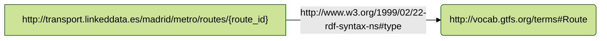
- **joinCondition**: This is used for specifying conditions for joining different data sources or tables.
In this representation, **equal**() specifies the conditions for joining. The **<#TriplesMap1>**.field1 and **<#TriplesMap2**>.field2 represent the values field1, fiel2 in the TM1 and TM2 used for the join.
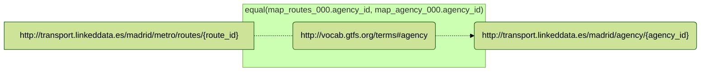
## map_stoptimes_000
- **Source**

```bash
/data/STOP_TIMES.csv
``` 
- **Subject**
```bash
http://transport.linkeddata.es/madrid/metro/stoptimes/{trip_id}-{stop_id}-{arrival_time}
``` 
- **Predicate Object**

| Predicate | Object |
|:----------|:-------|
| http://www.w3.org/1999/02/22-rdf-syntax-ns#type | http://vocab.gtfs.org/terms#StopTime |
- **The RDF triples generated**
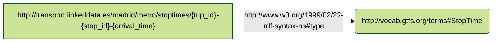
- **joinCondition**: This is used for specifying conditions for joining different data sources or tables.
In this representation, **equal**() specifies the conditions for joining. The **<#TriplesMap1>**.field1 and **<#TriplesMap2**>.field2 represent the values field1, fiel2 in the TM1 and TM2 used for the join.
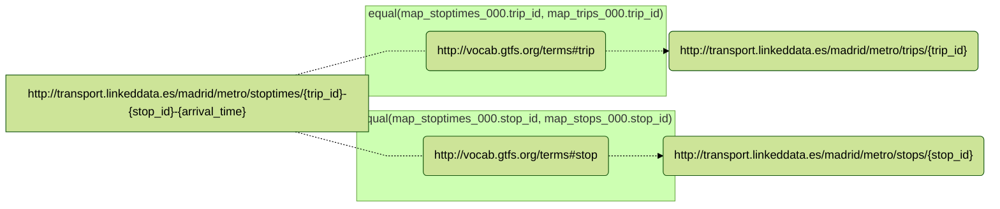
## map_stops_000
- **Source**

```bash
/data/STOPS.csv
``` 
- **Subject**
```bash
http://transport.linkeddata.es/madrid/metro/stops/{stop_id}
``` 
- **Predicate Object**

| Predicate | Object |
|:----------|:-------|
| http://www.w3.org/1999/02/22-rdf-syntax-ns#type | http://vocab.gtfs.org/terms#Stop |
- **The RDF triples generated**
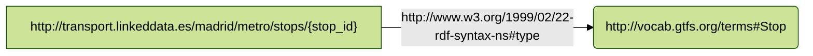
- **joinCondition**: This is used for specifying conditions for joining different data sources or tables.
In this representation, **equal**() specifies the conditions for joining. The **<#TriplesMap1>**.field1 and **<#TriplesMap2**>.field2 represent the values field1, fiel2 in the TM1 and TM2 used for the join.
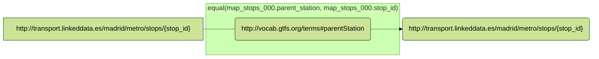
## map_shapePoints_000
- **Source**

```bash
/data/SHAPES.csv
``` 
- **Subject**
```bash
http://transport.linkeddata.es/madrid/metro/shape_point/{shape_id}-{shape_pt_sequence}
``` 
- **Predicate Object**

| Predicate | Object |
|:----------|:-------|
| http://www.w3.org/1999/02/22-rdf-syntax-ns#type | http://vocab.gtfs.org/terms#ShapePoint |
- **The RDF triples generated**
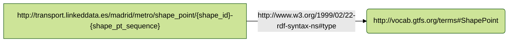
- **joinCondition**: This is used for specifying conditions for joining different data sources or tables.
In this representation, **equal**() specifies the conditions for joining. The **<#TriplesMap1>**.field1 and **<#TriplesMap2**>.field2 represent the values field1, fiel2 in the TM1 and TM2 used for the join.
```mermaid
%%{ init : { "theme" : "forest", "flowchart" : { "curve" : "linear" }}}%%

flowchart LR
  
``` 
## map_services1_000
- **Source**

```bash
/data/CALENDAR.csv
``` 
- **Subject**
```bash
http://transport.linkeddata.es/madrid/metro/services/{service_id}
``` 
- **Predicate Object**

| Predicate | Object |
|:----------|:-------|
| http://www.w3.org/1999/02/22-rdf-syntax-ns#type | http://vocab.gtfs.org/terms#Service |
- **The RDF triples generated**
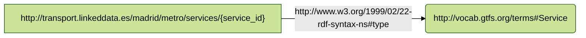
- **joinCondition**: This is used for specifying conditions for joining different data sources or tables.
In this representation, **equal**() specifies the conditions for joining. The **<#TriplesMap1>**.field1 and **<#TriplesMap2**>.field2 represent the values field1, fiel2 in the TM1 and TM2 used for the join.
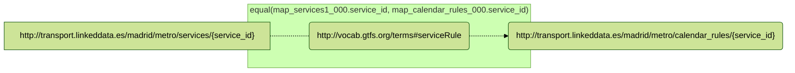
## map_frequencies_000
- **Source**

```bash
/data/FREQUENCIES.csv
``` 
- **Subject**
```bash
http://transport.linkeddata.es/madrid/metro/frequency/{trip_id}-{start_time}
``` 
- **Predicate Object**

| Predicate | Object |
|:----------|:-------|
| http://www.w3.org/1999/02/22-rdf-syntax-ns#type | http://vocab.gtfs.org/terms#Frequency |
- **The RDF triples generated**
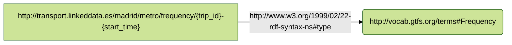
- **joinCondition**: This is used for specifying conditions for joining different data sources or tables.
In this representation, **equal**() specifies the conditions for joining. The **<#TriplesMap1>**.field1 and **<#TriplesMap2**>.field2 represent the values field1, fiel2 in the TM1 and TM2 used for the join.
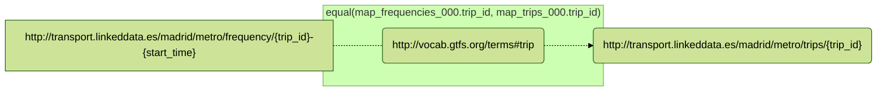
## map_feed_000
- **Source**

```bash
/data/FEED_INFO.csv
``` 
- **Subject**
```bash
http://transport.linkeddata.es/madrid/metro/feed/{feed_publisher_name}
``` 
- **Predicate Object**

| Predicate | Object |
|:----------|:-------|
| http://www.w3.org/1999/02/22-rdf-syntax-ns#type | http://vocab.gtfs.org/terms#Feed |
- **The RDF triples generated**
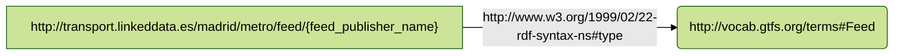
- **joinCondition**: This is used for specifying conditions for joining different data sources or tables.
In this representation, **equal**() specifies the conditions for joining. The **<#TriplesMap1>**.field1 and **<#TriplesMap2**>.field2 represent the values field1, fiel2 in the TM1 and TM2 used for the join.
```mermaid
%%{ init : { "theme" : "forest", "flowchart" : { "curve" : "linear" }}}%%

flowchart LR
  
``` 
## map_services2_000
- **Source**

```bash
/data/CALENDAR_DATES.csv
``` 
- **Subject**
```bash
http://transport.linkeddata.es/madrid/metro/services/{service_id}
``` 
- **Predicate Object**

| Predicate | Object |
|:----------|:-------|
| http://www.w3.org/1999/02/22-rdf-syntax-ns#type | http://vocab.gtfs.org/terms#Service |
- **The RDF triples generated**

- **joinCondition**: This is used for specifying conditions for joining different data sources or tables.
In this representation, **equal**() specifies the conditions for joining. The **<#TriplesMap1>**.field1 and **<#TriplesMap2**>.field2 represent the values field1, fiel2 in the TM1 and TM2 used for the join.
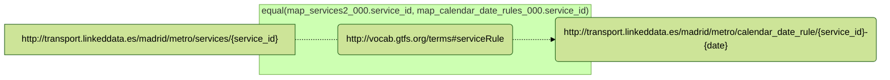
## map_calendar_date_rules_000
- **Source**

```bash
/data/CALENDAR_DATES.csv
``` 
- **Subject**
```bash
http://transport.linkeddata.es/madrid/metro/calendar_date_rule/{service_id}-{date}
``` 
- **Predicate Object**

| Predicate | Object |
|:----------|:-------|
| http://www.w3.org/1999/02/22-rdf-syntax-ns#type | http://vocab.gtfs.org/terms#CalendarDateRule |
- **The RDF triples generated**
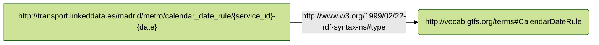
- **joinCondition**: This is used for specifying conditions for joining different data sources or tables.
In this representation, **equal**() specifies the conditions for joining. The **<#TriplesMap1>**.field1 and **<#TriplesMap2**>.field2 represent the values field1, fiel2 in the TM1 and TM2 used for the join.
```mermaid
%%{ init : { "theme" : "forest", "flowchart" : { "curve" : "linear" }}}%%

flowchart LR
  
``` 
## map_agency_000
- **Source**

```bash
/data/AGENCY.csv
``` 
- **Subject**
```bash
http://transport.linkeddata.es/madrid/agency/{agency_id}
``` 
- **Predicate Object**

| Predicate | Object |
|:----------|:-------|
| http://www.w3.org/1999/02/22-rdf-syntax-ns#type | http://vocab.gtfs.org/terms#Agency |
- **The RDF triples generated**
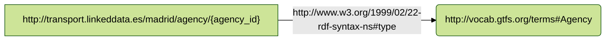
- **joinCondition**: This is used for specifying conditions for joining different data sources or tables.
In this representation, **equal**() specifies the conditions for joining. The **<#TriplesMap1>**.field1 and **<#TriplesMap2**>.field2 represent the values field1, fiel2 in the TM1 and TM2 used for the join.
```mermaid
%%{ init : { "theme" : "forest", "flowchart" : { "curve" : "linear" }}}%%

flowchart LR
  
``` 
## map_shapes_000
- **Source**

```bash
/data/SHAPES.csv
``` 
- **Subject**
```bash
http://transport.linkeddata.es/madrid/metro/shape/{shape_id}
``` 
- **Predicate Object**

| Predicate | Object |
|:----------|:-------|
| http://www.w3.org/1999/02/22-rdf-syntax-ns#type | http://vocab.gtfs.org/terms#Shape |
- **The RDF triples generated**
```mermaid
%%{ init : { "theme" : "forest", "flowchart" : { "curve" : "linear" }}}%%
flowchart LR
S["http://transport.linkeddata.es/madrid/metro/shape/{shape_id}"] -->|"http://www.w3.org/1999/02/22-rdf-syntax-ns#type"| object1("http://vocab.gtfs.org/terms#Shape")
    
``` 
- **joinCondition**: This is used for specifying conditions for joining different data sources or tables.
In this representation, **equal**() specifies the conditions for joining. The **<#TriplesMap1>**.field1 and **<#TriplesMap2**>.field2 represent the values field1, fiel2 in the TM1 and TM2 used for the join.
```mermaid
%%{ init : { "theme" : "forest", "flowchart" : { "curve" : "linear" }}}%%

flowchart LR
S["http://transport.linkeddata.es/madrid/metro/shape/{shape_id}"] .- B1
subgraph s1["equal(map_shapes_000.shape_id, map_shapePoints_000.shape_id)"]
B1("http://vocab.gtfs.org/terms#shapePoint")
end
B1 .-> o1("http://transport.linkeddata.es/madrid/metro/shape_point/{shape_id}-{shape_pt_sequence}")
  
``` 
## map_calendar_rules_000
- **Source**

```bash
/data/CALENDAR.csv
``` 
- **Subject**
```bash
http://transport.linkeddata.es/madrid/metro/calendar_rules/{service_id}
``` 
- **Predicate Object**

| Predicate | Object |
|:----------|:-------|
| http://www.w3.org/1999/02/22-rdf-syntax-ns#type | http://vocab.gtfs.org/terms#CalendarRule |
- **The RDF triples generated**
```mermaid
%%{ init : { "theme" : "forest", "flowchart" : { "curve" : "linear" }}}%%
flowchart LR
S["http://transport.linkeddata.es/madrid/metro/calendar_rules/{service_id}"] -->|"http://www.w3.org/1999/02/22-rdf-syntax-ns#type"| object1("http://vocab.gtfs.org/terms#CalendarRule")
    
``` 
- **joinCondition**: This is used for specifying conditions for joining different data sources or tables.
In this representation, **equal**() specifies the conditions for joining. The **<#TriplesMap1>**.field1 and **<#TriplesMap2**>.field2 represent the values field1, fiel2 in the TM1 and TM2 used for the join.
```mermaid
%%{ init : { "theme" : "forest", "flowchart" : { "curve" : "linear" }}}%%

flowchart LR
  
``` 
## map_trips_000
- **Source**

```bash
/data/TRIPS.csv
``` 
- **Subject**
```bash
http://transport.linkeddata.es/madrid/metro/trips/{trip_id}
``` 
- **Predicate Object**

| Predicate | Object |
|:----------|:-------|
| http://www.w3.org/1999/02/22-rdf-syntax-ns#type | http://vocab.gtfs.org/terms#Trip |
- **The RDF triples generated**
```mermaid
%%{ init : { "theme" : "forest", "flowchart" : { "curve" : "linear" }}}%%
flowchart LR
S["http://transport.linkeddata.es/madrid/metro/trips/{trip_id}"] -->|"http://www.w3.org/1999/02/22-rdf-syntax-ns#type"| object1("http://vocab.gtfs.org/terms#Trip")
    
``` 
- **joinCondition**: This is used for specifying conditions for joining different data sources or tables.
In this representation, **equal**() specifies the conditions for joining. The **<#TriplesMap1>**.field1 and **<#TriplesMap2**>.field2 represent the values field1, fiel2 in the TM1 and TM2 used for the join.
```mermaid
%%{ init : { "theme" : "forest", "flowchart" : { "curve" : "linear" }}}%%

flowchart LR
S["http://transport.linkeddata.es/madrid/metro/trips/{trip_id}"] .- B1
subgraph s1["equal(map_trips_000.service_id, map_services1_000.service_id)"]
B1("http://vocab.gtfs.org/terms#service")
end
B1 .-> o1("http://transport.linkeddata.es/madrid/metro/services/{service_id}")
S["http://transport.linkeddata.es/madrid/metro/trips/{trip_id}"] .- B2
subgraph s2["equal(map_trips_000.service_id, map_services2_000.service_id)"]
B2("http://vocab.gtfs.org/terms#service")
end
B2 .-> o2("http://transport.linkeddata.es/madrid/metro/services/{service_id}")
S["http://transport.linkeddata.es/madrid/metro/trips/{trip_id}"] .- B3
subgraph s3["equal(map_trips_000.route_id, map_routes_000.route_id)"]
B3("http://vocab.gtfs.org/terms#route")
end
B3 .-> o3("http://transport.linkeddata.es/madrid/metro/routes/{route_id}")
S["http://transport.linkeddata.es/madrid/metro/trips/{trip_id}"] .- B4
subgraph s4["equal(map_trips_000.shape_id, map_shapes_000.shape_id)"]
B4("http://vocab.gtfs.org/terms#shape")
end
B4 .-> o4("http://transport.linkeddata.es/madrid/metro/shape/{shape_id}")
  
``` 


----

**Copyright © 2023** *[Ontology Engineering Group](https://oeg.fi.upm.es/)*, *[Universidad Politécnica de Madrid](https://www.upm.es/internacional)*.
