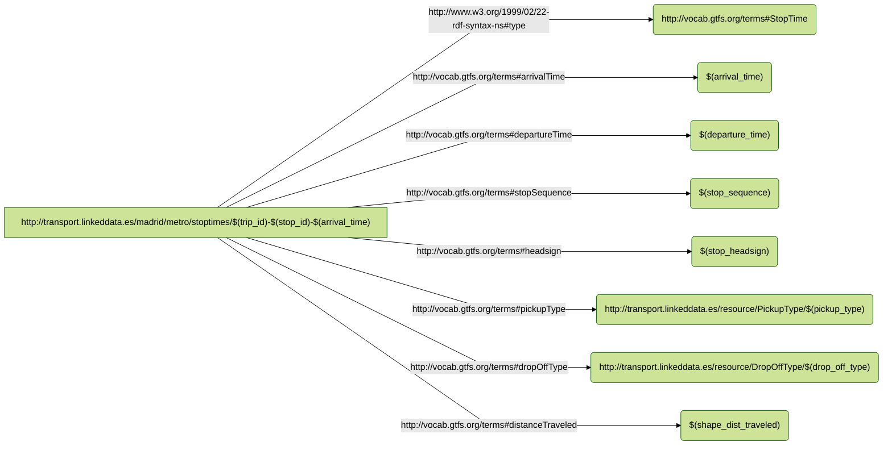
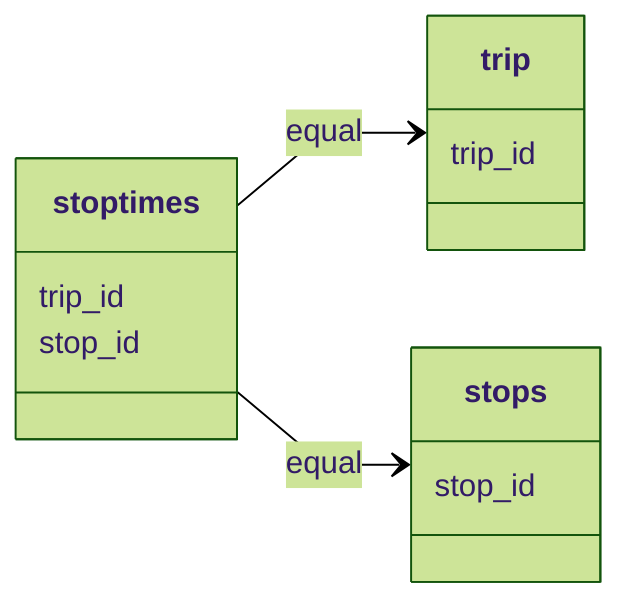

# RDF Mapping Documentation (RMD)

**Version:**

**Authors**:

**License**:

[-blue.svg)](https://creativecommons.org/licenses/by/4.0/)

------


## **Namespaces used in the document**

| Prefix       |               IRI.                   |
| :----------- | :----------------------------------  |
| rr     | http://www.w3.org/ns/r2rml# |
| foaf     | http://xmlns.com/foaf/0.1/ |
| xsd     | http://www.w3.org/2001/XMLSchema# |
| rdfs     | http://www.w3.org/2000/01/rdf-schema# |
| dc     | http://purl.org/dc/elements/1.1/ |
| rev     | http://purl.org/stuff/rev# |
| gtfs     | http://vocab.gtfs.org/terms# |
| geo     | http://www.w3.org/2003/01/geo/wgs84_pos# |
| schema     | http://schema.org/ |
| dct     | http://purl.org/dc/terms/ |
| rml     | http://semweb.mmlab.be/ns/rml# |
| ql     | http://semweb.mmlab.be/ns/ql# |
| rdf     | http://www.w3.org/1999/02/22-rdf-syntax-ns# |


## mappings
### stoptimes

- **Source**

```bash
['/data/STOP_TIMES.csv']
```

- **Subject**


```bash
http://transport.linkeddata.es/madrid/metro/stoptimes/$(trip_id)-$(stop_id)-$(arrival_time)
```

- **Predicate Object**

| Predicate |                Object                |
| :----------- | :----------------------------------  |
| gtfs:arrivalTime    | $(arrival_time) |
| gtfs:departureTime    | $(departure_time) |
| gtfs:trip |  |

- **The RDF triples generated**




- **Function: equal**




>[!NOTE]
>Is used to generate subject IRIs from the following template


> [!IMPORTANT]
> Crucial information necessary for users to succeed.


> This is a blockquote with two paragraphs. Lorem ipsum dolor sit amet,
> consectetuer adipiscing elit. Aliquam hendrerit mi posuere lectus.
> Vestibulum enim wisi, viverra nec, fringilla in, laoreet vitae, risus.
> 
> Donec sit amet nisl. Aliquam semper ipsum sit amet velit. Suspendisse
> id sem consectetuer libero luctus adipiscing.
Markdown allows you to be lazy and only put the > before the first line of a hard-wrapped paragraph:

> This is a blockquote with two paragraphs. Lorem ipsum dolor sit amet,
consectetuer adipiscing elit. Aliquam hendrerit mi posuere lectus.
Vestibulum enim wisi, viverra nec, fringilla in, laoreet vitae, risus.

> Donec sit amet nisl. Aliquam semper ipsum sit amet velit. Suspendisse
id sem consectetuer libero luctus adipiscing.