# RDF Mapping Documentation (RMD)

**Version:**

**Authors**:


**License**:

[-blue.svg)](https://creativecommons.org/licenses/by/4.0/)

------


## **Namespaces used in the document**

| Prefix       |               IRI.                   |
| :----------- | :----------------------------------  |
| brick     | https://brickschema.org/schema/Brick# |
| csvw     | http://www.w3.org/ns/csvw# |
| dc     | http://purl.org/dc/elements/1.1/ |
| dcat     | http://www.w3.org/ns/dcat# |
| dcmitype     | http://purl.org/dc/dcmitype/ |
| dcam     | http://purl.org/dc/dcam/ |
| doap     | http://usefulinc.com/ns/doap# |
| foaf     | http://xmlns.com/foaf/0.1/ |
| geo     | http://www.opengis.net/ont/geosparql# |
| odrl     | http://www.w3.org/ns/odrl/2/ |
| org     | http://www.w3.org/ns/org# |
| prof     | http://www.w3.org/ns/dx/prof/ |
| prov     | http://www.w3.org/ns/prov# |
| qb     | http://purl.org/linked-data/cube# |
| schema     | https://schema.org/ |
| sh     | http://www.w3.org/ns/shacl# |
| skos     | http://www.w3.org/2004/02/skos/core# |
| sosa     | http://www.w3.org/ns/sosa/ |
| ssn     | http://www.w3.org/ns/ssn/ |
| time     | http://www.w3.org/2006/time# |
| vann     | http://purl.org/vocab/vann/ |
| void     | http://rdfs.org/ns/void# |
| wgs     | https://www.w3.org/2003/01/geo/wgs84_pos# |
| owl     | http://www.w3.org/2002/07/owl# |
| rdf     | http://www.w3.org/1999/02/22-rdf-syntax-ns# |
| rdfs     | http://www.w3.org/2000/01/rdf-schema# |
| xsd     | http://www.w3.org/2001/XMLSchema# |
| xml     | http://www.w3.org/XML/1998/namespace |
| rr     | http://www.w3.org/ns/r2rml# |
| fnml     | http://semweb.mmlab.be/ns/fnml# |
| fno     | https://w3id.org/function/ontology# |
| d2rq     | http://www.wiwiss.fu-berlin.de/suhl/bizer/D2RQ/0.1# |
| rml     | http://semweb.mmlab.be/ns/rml# |
| ql     | http://semweb.mmlab.be/ns/ql# |
|      | http://mapping.example.com/ |
| rev     | http://purl.org/stuff/rev# |
| gtfs     | http://vocab.gtfs.org/terms# |
| geo1     | http://www.w3.org/2003/01/geo/wgs84_pos# |
| schema1     | http://schema.org/ |
| dct     | http://purl.org/dc/terms/ |


## Mappings
>[!NOTE]
>1. **Source**: This is where you define the source of your data, which can be a relational database, a CSV file, or any other structured data source. The logical source specifies the location and format of your source data.
>2. **Subject**: This part of the mapping defines how the data from the logical source will be used to create RDF subjects, typically using templates and column mappings.
>3. **Predicate Object**: These describe how the data from the logical source will be used to generate RDF triples, indicating relationships between subjects and objects.


## map_services1_0
- **Source**

```bash
/data/CALENDAR.csv

``` 
- **Subject**
```bash
http://transport.linkeddata.es/madrid/metro/services/{service_id}

``` 
- **Predicate Object**

| Predicate | Object |
|:----------|:-------|
| http://www.w3.org/1999/02/22-rdf-syntax-ns#type | http://vocab.gtfs.org/terms#Service |
- **The RDF triples generated**
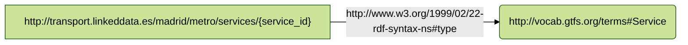
## map_services2_0
- **Source**

```bash
/data/CALENDAR_DATES.csv

``` 
- **Subject**
```bash
http://transport.linkeddata.es/madrid/metro/services/{service_id}

``` 
- **Predicate Object**

| Predicate | Object |
|:----------|:-------|
| http://www.w3.org/1999/02/22-rdf-syntax-ns#type | http://vocab.gtfs.org/terms#Service |
- **The RDF triples generated**

## map_routes_0
- **Source**

```bash
/data/ROUTES.csv

``` 
- **Subject**
```bash
http://transport.linkeddata.es/madrid/metro/routes/{route_id}

``` 
- **Predicate Object**

| Predicate | Object |
|:----------|:-------|
| http://www.w3.org/1999/02/22-rdf-syntax-ns#type | http://vocab.gtfs.org/terms#Route |
| http://vocab.gtfs.org/terms#shortName | route_short_name |
| http://vocab.gtfs.org/terms#longName | route_long_name |
| http://purl.org/dc/terms/description | route_desc |
| http://vocab.gtfs.org/terms#routeUrl | route_url |
| http://vocab.gtfs.org/terms#color | route_color |
| http://vocab.gtfs.org/terms#textColor | route_text_color |
- **The RDF triples generated**
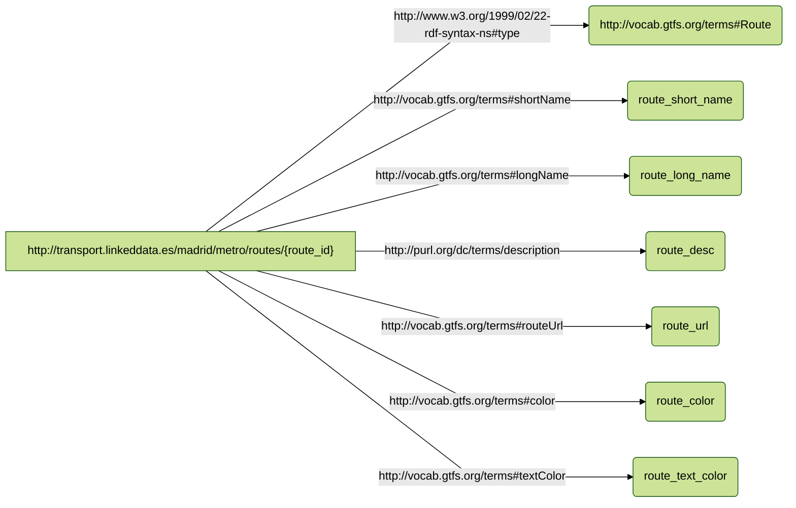
## map_shapes_0
- **Source**

```bash
/data/SHAPES.csv

``` 
- **Subject**
```bash
http://transport.linkeddata.es/madrid/metro/shape/{shape_id}

``` 
- **Predicate Object**

| Predicate | Object |
|:----------|:-------|
| http://www.w3.org/1999/02/22-rdf-syntax-ns#type | http://vocab.gtfs.org/terms#Shape |
- **The RDF triples generated**
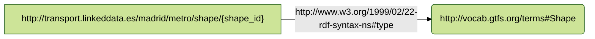
## map_calendar_date_rules_0
- **Source**

```bash
/data/CALENDAR_DATES.csv

``` 
- **Subject**
```bash
http://transport.linkeddata.es/madrid/metro/calendar_date_rule/{service_id}-{date}

``` 
- **Predicate Object**

| Predicate | Object |
|:----------|:-------|
| http://www.w3.org/1999/02/22-rdf-syntax-ns#type | http://vocab.gtfs.org/terms#CalendarDateRule |
| http://purl.org/dc/terms/date | date |
| http://vocab.gtfs.org/terms#dateAddition | exception_type |
- **The RDF triples generated**
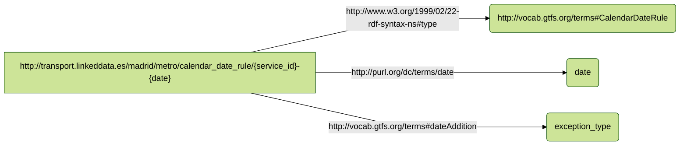
## map_frequencies_0
- **Source**

```bash
/data/FREQUENCIES.csv

``` 
- **Subject**
```bash
http://transport.linkeddata.es/madrid/metro/frequency/{trip_id}-{start_time}

``` 
- **Predicate Object**

| Predicate | Object |
|:----------|:-------|
| http://www.w3.org/1999/02/22-rdf-syntax-ns#type | http://vocab.gtfs.org/terms#Frequency |
| http://vocab.gtfs.org/terms#startTime | start_time |
| http://vocab.gtfs.org/terms#endTime | end_time |
| http://vocab.gtfs.org/terms#headwaySeconds | headway_secs |
| http://vocab.gtfs.org/terms#exactTimes | exact_times |
- **The RDF triples generated**
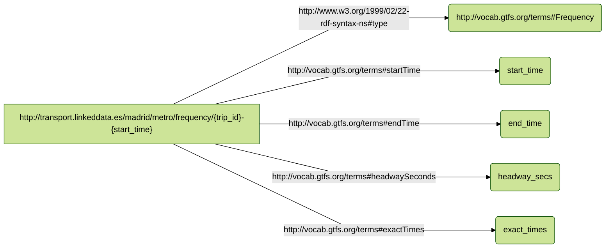
## map_stoptimes_0
- **Source**

```bash
/data/STOP_TIMES.csv

``` 
- **Subject**
```bash
http://transport.linkeddata.es/madrid/metro/stoptimes/{trip_id}-{stop_id}-{arrival_time}

``` 
- **Predicate Object**

| Predicate | Object |
|:----------|:-------|
| http://www.w3.org/1999/02/22-rdf-syntax-ns#type | http://vocab.gtfs.org/terms#StopTime |
| http://vocab.gtfs.org/terms#arrivalTime | arrival_time |
| http://vocab.gtfs.org/terms#departureTime | departure_time |
| http://vocab.gtfs.org/terms#stopSequence | stop_sequence |
| http://vocab.gtfs.org/terms#headsign | stop_headsign |
| http://vocab.gtfs.org/terms#distanceTraveled | shape_dist_traveled |
- **The RDF triples generated**
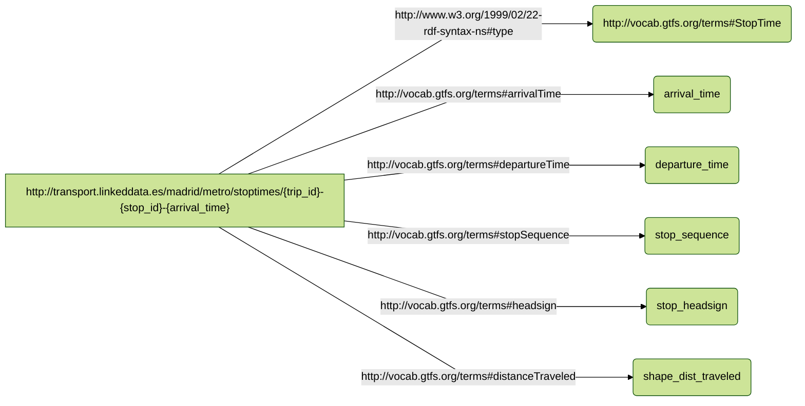
## map_trips_0
- **Source**

```bash
/data/TRIPS.csv

``` 
- **Subject**
```bash
http://transport.linkeddata.es/madrid/metro/trips/{trip_id}

``` 
- **Predicate Object**

| Predicate | Object |
|:----------|:-------|
| http://www.w3.org/1999/02/22-rdf-syntax-ns#type | http://vocab.gtfs.org/terms#Trip |
| http://vocab.gtfs.org/terms#headsign | trip_headsign |
| http://vocab.gtfs.org/terms#shortName | trip_short_name |
| http://vocab.gtfs.org/terms#direction | direction_id |
| http://vocab.gtfs.org/terms#block | block_id |
- **The RDF triples generated**
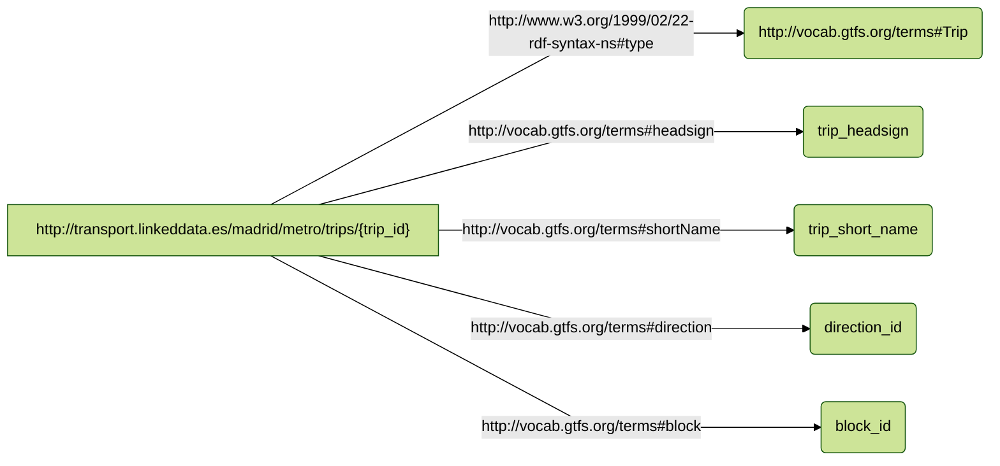
## map_agency_0
- **Source**

```bash
/data/AGENCY.csv

``` 
- **Subject**
```bash
http://transport.linkeddata.es/madrid/agency/{agency_id}

``` 
- **Predicate Object**

| Predicate | Object |
|:----------|:-------|
| http://www.w3.org/1999/02/22-rdf-syntax-ns#type | http://vocab.gtfs.org/terms#Agency |
| http://xmlns.com/foaf/0.1/page | agency_url |
| http://xmlns.com/foaf/0.1/name | agency_name |
| http://vocab.gtfs.org/terms#timeZone | agency_timezone |
| http://purl.org/dc/terms/language | agency_lang |
| http://xmlns.com/foaf/0.1/phone | agency_phone |
| http://vocab.gtfs.org/terms#fareUrl | agency_fare_url |
- **The RDF triples generated**
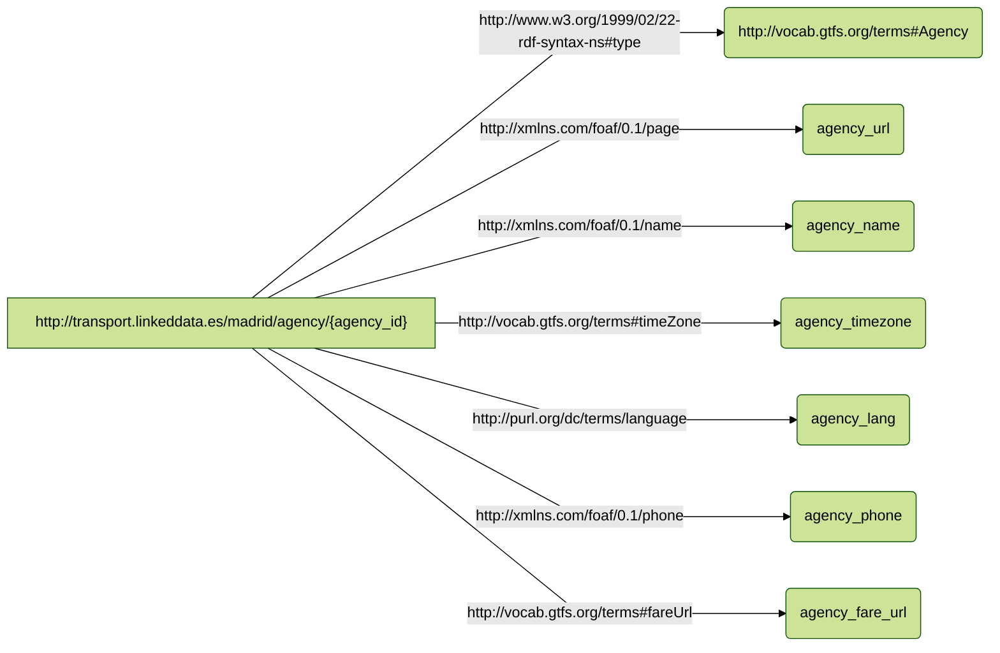
## map_shapePoints_0
- **Source**

```bash
/data/SHAPES.csv

``` 
- **Subject**
```bash
http://transport.linkeddata.es/madrid/metro/shape_point/{shape_id}-{shape_pt_sequence}

``` 
- **Predicate Object**

| Predicate | Object |
|:----------|:-------|
| http://www.w3.org/1999/02/22-rdf-syntax-ns#type | http://vocab.gtfs.org/terms#ShapePoint |
| http://www.w3.org/2003/01/geo/wgs84_pos#lat | shape_pt_lat |
| http://www.w3.org/2003/01/geo/wgs84_pos#long | shape_pt_lon |
| http://vocab.gtfs.org/terms#pointSequence | shape_pt_sequence |
| http://vocab.gtfs.org/terms#distanceTraveled | shape_dist_traveled |
- **The RDF triples generated**
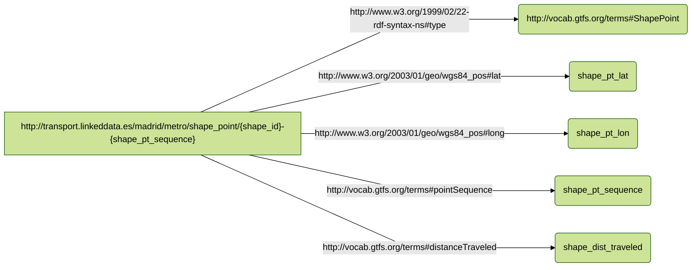
## map_stops_0
- **Source**

```bash
/data/STOPS.csv

``` 
- **Subject**
```bash
http://transport.linkeddata.es/madrid/metro/stops/{stop_id}

``` 
- **Predicate Object**

| Predicate | Object |
|:----------|:-------|
| http://www.w3.org/1999/02/22-rdf-syntax-ns#type | http://vocab.gtfs.org/terms#Stop |
| http://vocab.gtfs.org/terms#code | stop_code |
| http://purl.org/dc/terms/identifier | stop_id |
| http://xmlns.com/foaf/0.1/name | stop_name |
| http://purl.org/dc/terms/description | stop_desc |
| http://www.w3.org/2003/01/geo/wgs84_pos#lat | stop_lat |
| http://www.w3.org/2003/01/geo/wgs84_pos#long | stop_lon |
| http://vocab.gtfs.org/terms#zone | zone_id |
| http://xmlns.com/foaf/0.1/page | stop_url |
| http://vocab.gtfs.org/terms#timeZone | stop_timezone |
- **The RDF triples generated**
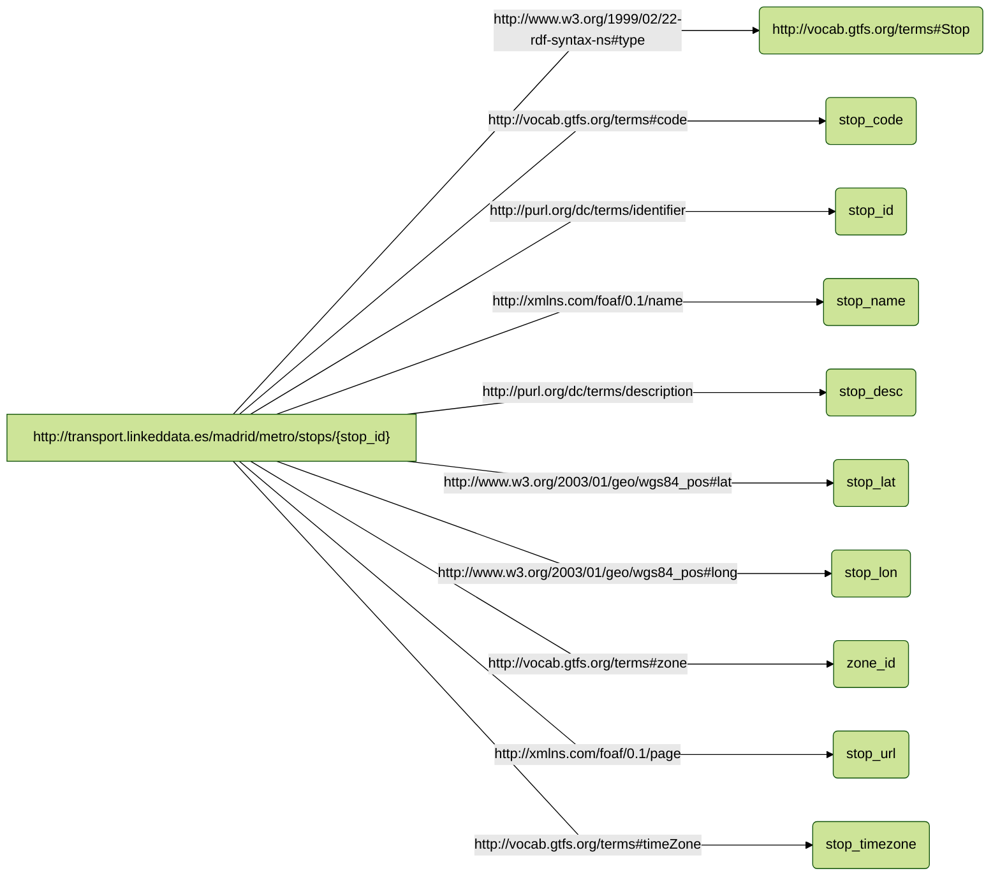
## map_feed_0
- **Source**

```bash
/data/FEED_INFO.csv

``` 
- **Subject**
```bash
http://transport.linkeddata.es/madrid/metro/feed/{feed_publisher_name}

``` 
- **Predicate Object**

| Predicate | Object |
|:----------|:-------|
| http://www.w3.org/1999/02/22-rdf-syntax-ns#type | http://vocab.gtfs.org/terms#Feed |
| http://purl.org/dc/terms/publisher | feed_publisher_name |
| http://xmlns.com/foaf/0.1/page | feed_publisher_url |
| http://purl.org/dc/terms/language | feed_lang |
| http://schema.org/startDate | feed_start_date |
| http://schema.org/endDate | feed_end_date |
| http://schema.org/version | feed_version |
- **The RDF triples generated**
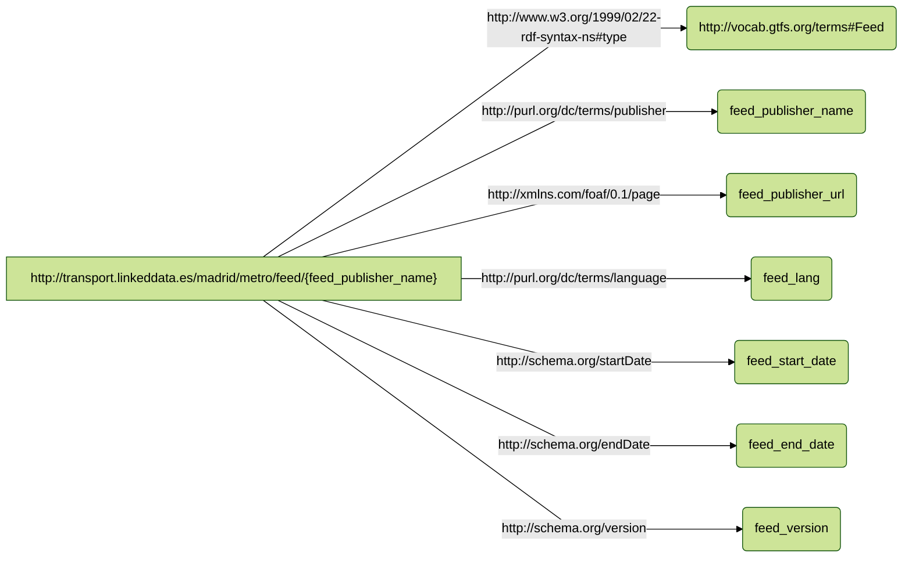
## map_calendar_rules_0
- **Source**

```bash
/data/CALENDAR.csv

``` 
- **Subject**
```bash
http://transport.linkeddata.es/madrid/metro/calendar_rules/{service_id}

``` 
- **Predicate Object**

| Predicate | Object |
|:----------|:-------|
| http://www.w3.org/1999/02/22-rdf-syntax-ns#type | http://vocab.gtfs.org/terms#CalendarRule |
| http://vocab.gtfs.org/terms#monday | monday |
| http://vocab.gtfs.org/terms#tuesday | tuesday |
| http://vocab.gtfs.org/terms#wednesday | wednesday |
| http://vocab.gtfs.org/terms#thursday | thursday |
| http://vocab.gtfs.org/terms#friday | friday |
| http://vocab.gtfs.org/terms#saturday | saturday |
| http://vocab.gtfs.org/terms#sunday | sunday |
| http://schema.org/startDate | start_date |
| http://schema.org/endDate | end_date |
- **The RDF triples generated**
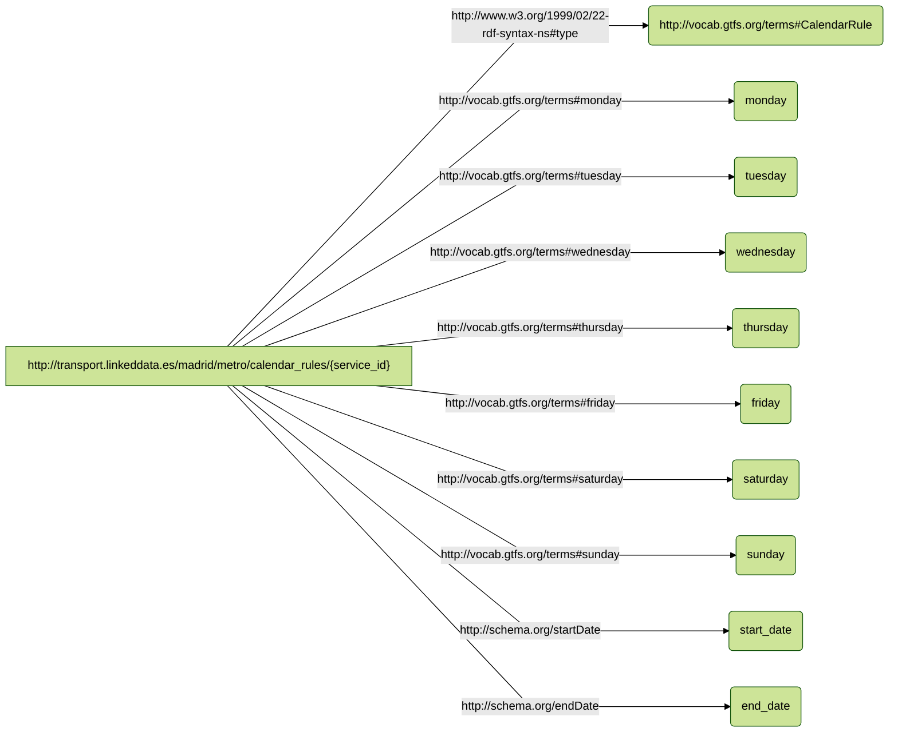


----

**Copyright © 2023** *[Ontology Engineering Group](https://oeg.fi.upm.es/)*, *[Universidad Politécnica de Madrid](https://www.upm.es/internacional)*.
